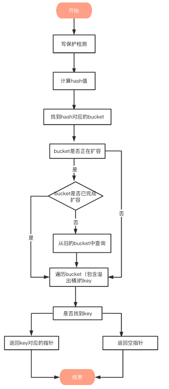

**集合**
- [内容](#内容)
  - [使用](#使用)
  - [结构](#结构)
  - [特性](#特性)
  - [查找](#查找)
  - [扩容](#扩容)
    - [负载因子](#负载因子)
    - [扩容](#扩容-1)

# 内容 #
## 使用 ##
**声明**  
var name map[key_type]value_type
name := make(map[key_type]value_type)

**删除**  
delete(map, key)

## 结构 ##


```
// A header for a Go map.
type hmap struct {
    count     int 
    // 代表哈希表中的元素个数，调用len(map)时，返回的就是该字段值。
    flags     uint8 
    // 状态标志（是否处于正在写入的状态等）
    B         uint8  
    // buckets（桶）的对数
    // 如果B=5，则buckets数组的长度 = 2^B=32，意味着有32个桶
    noverflow uint16 
    // 溢出桶的数量
    hash0     uint32 
    // 生成hash的随机数种子
    buckets    unsafe.Pointer 
    // 指向buckets数组的指针，数组大小为2^B，如果元素个数为0，它为nil。
    oldbuckets unsafe.Pointer 
    // 如果发生扩容，oldbuckets是指向老的buckets数组的指针，老的buckets数组大小是新的buckets的1/2;非扩容状态下，它为nil。
    nevacuate  uintptr        
    // 表示扩容进度，小于此地址的buckets代表已搬迁完成。
    extra *mapextra 
    // 存储溢出桶，这个字段是为了优化GC扫描而设计的，下面详细介绍
 }
```
```
// A bucket for a Go map.
type bmap struct {
    tophash [bucketCnt]uint8        
    // len为8的数组
    // 用来快速定位key是否在这个bmap中
    // 一个桶最多8个槽位，如果key所在的tophash值在tophash中，则代表该key在这个桶中
}
```
上面bmap结构是静态结构，在编译过程中runtime.bmap会拓展成以下结构体
```
type bmap struct{
    tophash [8]uint8
    keys [8]keytype 
    // keytype 由编译器编译时候确定
    values [8]elemtype 
    // elemtype 由编译器编译时候确定
    overflow uintptr 
    // overflow指向下一个bmap，overflow是uintptr而不是*bmap类型，保证bmap完全不含指针，是为了减少gc，溢出桶存储到extra字段中
}
```
```
type mapextra struct {
    overflow    *[]*bmap
    // overflow 包含的是 hmap.buckets 的 overflow 的 buckets
    oldoverflow *[]*bma
   // oldoverflow 包含扩容时 hmap.oldbuckets 的 overflow 的 bucket
    nextOverflow *bmap 
     // 指向空闲的 overflow bucket 的指针
}
```
## 特性 ##
**无序**  
- 每次遍历，都会从一个随机值序号的bucket，再从其中随机的cell开始遍历
- map在扩容后，会发生key的搬迁

**非线程安全**  

**线程安全**
- map + sync.RWMutex
- sync.Map

## 查找 ##


## 扩容 ##
### 负载因子 ###  
负载因子 = 哈希表存储的元素个数/桶个数  

### 扩容 ###  
**超过负载**
map元素个数 > 6.5 * 桶个数  
*双倍扩容*

**溢出桶太多**  
当桶总数 < 2 ^ 15 时，如果溢出桶总数 >= 桶总数，则认为溢出桶过多  
当桶总数 >= 2 ^ 15 时，直接与 2 ^ 15 比较，当溢出桶总数 >= 2 ^ 15 时，即认为溢出桶太多了
*等量扩容*

**渐进式扩容**  
