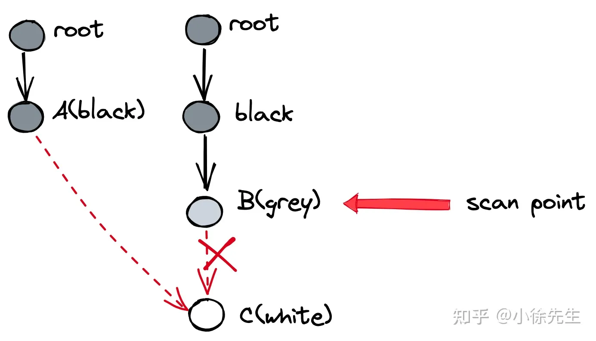

**内存管理**
- [内容](#内容)
  - [内存分配](#内存分配)
  - [内存逃逸](#内存逃逸)
  - [内存对齐](#内存对齐)
  - [垃圾回收](#垃圾回收)
    - [特点](#特点)
    - [常用算法](#常用算法)
    - [golang中的垃圾回收](#golang中的垃圾回收)
    - [漏标问题](#漏标问题)

# 内容 #
## 内存分配 ##
**内存模型**  

**设计思想**  
- 内存分配算法采用Google的TCMalloc算法，每个线程都会自行维护一个独立的内存池，进行内存分配时优先从该内存池中分配，当内存池不足时才会向加锁向全局内存池申请，减少系统调用并且避免不同线程对全局内存池的锁竞争
- 把内存切分的非常的细小，分为多级管理，以降低锁的粒度
- 回收对象内存时，并没有将其真正释放掉，只是放回预先分配的大块内存中，以便复用。只有内存闲置过多的时候，才会尝试归还部分内存给操作系统，降低整体开销
  
**内存单元mspan**  
- mspan是Golang内存管理的最小单元
- mspan大小是page的整数倍（Go中的page大小为 8KB），且内部的页是连续的（至少在虚拟内存的视角中是这样）
- 每个mspan根据空间大小以及面向分配对象的大小，会被划分为不同的等级
- 同等级的 mspan 会从属同一个 mcentral，最终会被组织成链表，因此带有前后指针（prev、next）
- 由于同等级的 mspan 内聚于同一个 mcentral，所以会基于同一把互斥锁管理
- mspan 会基于 bitMap 辅助快速找到空闲内存块（块大小为对应等级下的 object 大小），此时需要使用到 Ctz64 算法

**线程缓存mcache**  
- mcache 是每个 P 独有的缓存，因此交互无锁
- mcache 将每种 spanClass 等级的 mspan 各缓存了一个，总数为 2（nocan 维度） * 68（大小维度）= 136
- mcache 中还有一个对象分配器 tiny allocator，用于处理小于 16B 对象的内存分配

**中心缓存mcentral**  
- 每个 mcentral 对应一种 spanClass
- 每个 mcentral 下聚合了该 spanClass 下的 mspan
- mcentral 下的 mspan 分为两个链表，分别为有空间 mspan 链表 partial 和满空间 mspan 链表 full
- 每个 mcentral 一把锁

**全局堆缓存mheap**  
- 以页（8KB）为单位，作为最小内存存储单元
- 负责将连续页组装成 mspan
- 全局内存基于 bitMap 标识其使用情况，每个 bit 对应一页，为 0 则自由，为 1 则已被 mspan 组装
- 通过 heapArena 聚合页，记录了页到 mspan 的映射信息
- 是 mcentral 的持有者，持有所有 spanClass 下的 mcentral，作为自身的缓存
- 内存不够时，向操作系统申请，申请单位为 heapArena（64M）

**分配对象**  
- 微对象 (0, 16B) 先使用线程缓存上的微型分配器，再依次尝试线程缓存、中心缓存、堆分配内存；
- 小对象 [16B, 32KB] 依次尝试线程缓存、中心缓存、堆分配内存；
- 大对象 (32KB, +∞) 直接尝试堆分配内存

## 内存逃逸 ##
**内存分配**  
- 堆 手动进行管理，手动申请、分配、释放
- 栈 编译器进行管理，自动申请、分配、释放

**内存逃逸**  
本该分配到栈上的内存，在堆上进行分配

**逃逸机制**  
- 如果函数外部没有引用，则优先放到栈中
- 如果函数外部存在引用，则必定放到堆中
- 如果栈上放不下，则必定放到堆上
  
**逃逸场景**  
- 指针逃逸
- 栈空间不足
- 变量大小不确定
- 动态类型
- 闭包引用对象

## 内存对齐 ##
**对齐系数**  
- Go原始类型的对齐系数与类型长度相等
- Go结构体类型的对齐系数是最长字段的对齐系数和系统对齐系数两者中的最小的那个

**struct内存对齐规则**   
- 首先确定struct的每个字段的长度Size和对齐系数Align
- 其次保证每个字段的Offset与其对齐系数Align"对齐"，这里"对齐"的意思是要保证字段Offset是其Align的整数倍，如果不能保证则需要在字段前面添加padding直到能对齐
- 最后要保证整个结构体的长度Size与结构体自己的对齐系数Align"对齐"，即最后确定结构体的长度是结构体Align的整数倍

## 垃圾回收 ##
### 特点 ###
**优势**  
- 屏蔽内存回收的细节
- 以全局视野执行任务

**弊端**  
- 提高了下限但降低了上限
- 增加了额外的成本

### 常用算法 ###
**标记清扫**  
- 标记 标记出当前还存活的对象
- 清扫 清扫掉未被标记到的垃圾对象

*不足*  
- 产生内存碎片

**标记压缩**  
在标记清扫算法的基础上做了升级，在第二步”清扫“的同时还会对存活对象进行压缩整合，使得整体空间更为紧凑，从而解决内存碎片问题  

*不足*  
- 实现时会有很高的复杂度

**半空间复制** 
- 分配两片相等大小的空间，称为 fromspace 和 tospace
- 每轮只使用 fromspace 空间，以GC作为分水岭划分轮次
- GC时，将fromspace存活对象转移到tospace中，并以此为契机对空间进行压缩整合
- GC后，交换fromspace和tospace，开启新的轮次

*不足*  
- 比较浪费空间

**引用计数**  
- 对象每被引用一次，计数器加1
- 对象每被删除引用一次，计数器减1
- GC时，把计数器等于 0 的对象删除

*不足*  
- 无法解决循环引用或者自引用问题

### golang中的垃圾回收 ###
**三色标记法**  
- 对象分为三种颜色标记：黑、灰、白
- 黑对象代表，对象自身存活，且其指向对象都已标记完成
- 灰对象代表，对象自身存活，但其指向对象还未标记完成
- 白对象代表，对象尙未被标记到，可能是垃圾对象
- 标记开始前，将根对象（全局对象、栈上局部变量等）置黑，将其所指向的对象置灰
- 标记规则是，从灰对象出发，将其所指向的对象都置灰. 所有指向对象都置灰后，当前灰对象置黑
- 标记结束后，白色对象就是不可达的垃圾对象，需要进行清扫

*根对象*  
- 全局变量 程序在编译期就能确定的那些存在于程序整个生命周期的变量
- 执行栈 每个 goroutine 都包含自己的执行栈，这些执行栈上指向堆内存的指针
- 寄存器 寄存器的值可能表示一个指针，参与计算的这些指针可能指向某些赋值器分配的堆内存区块

**并发垃圾回收**  
*漏标问题*  

- 条件：初始时刻，对象B持有对象C的引用
- moment1：GC协程下，对象A被扫描完成，置黑；此时对象B是灰色，还未完成扫描
- momen2：用户协程下，对象A建立指向对象C的引用
- moment3：用户协程下，对象B删除指向对象C的引用
- moment4：GC协程下，开始执行对对象B的扫描

*多标问题*  

- 条件：初始时刻，对象A持有对象B的引用
- moment1：GC协程下，对象A被扫描完成，置黑；对象B被对象A引用，因此被置灰
- momen2：用户协程下，对象A删除指向对象B的引用

*内存碎片问题*  
Golang采用 TCMalloc 机制，依据对象的大小将其归属为到事先划分好的spanClass当中，这样能够消解外部碎片的问题，将问题限制在相对可控的内部碎片当中

*分代垃圾回收机制*  
Golang中存在内存逃逸机制，会在编译过程中将生命周期更长的对象转移到堆中，将生命周期短的对象分配在栈上，并以栈为单位对这部分对象进行回收

### 漏标问题 ###  
**本质**  
一个已经扫描完成的黑对象指向了一个被灰\白对象删除引用的白色对象
- (1)黑色对象指向了白色对象
- (2)灰、白对象删除了白色对象
- (3)(1)、(2)步中谈及的白色对象是同一个对象
- (4)(1)发生在(2)之前

**解决**  
- 强三色不变式 白色对象不能被黑色对象直接引用（直接破坏（1））
- 弱三色不变式 白色对象可以被黑色对象引用，但要从某个灰对象出发仍然可达该白对象（间接破坏了（1）、（2）的联动）

*插入写屏障*  
插入写屏障（Dijkstra）的目标是实现强三色不变式，保证当一个黑色对象指向一个白色对象前，会先触发屏障将白色对象置为灰色，再建立引用

*删除写屏障*  
删除写屏障（Yuasa barrier）的目标是实现弱三色不变式，保证当一个白色对象即将被上游删除引用前，会触发屏障将其置灰，之后再删除上游指向其的引用

*混合写屏障*  
- GC 开始前，以栈为单位分批扫描，将栈中所有对象置黑
- GC 期间，栈上新创建对象直接置黑
- 堆对象正常启用插入写屏障
- 堆对象正常启用删除写屏障