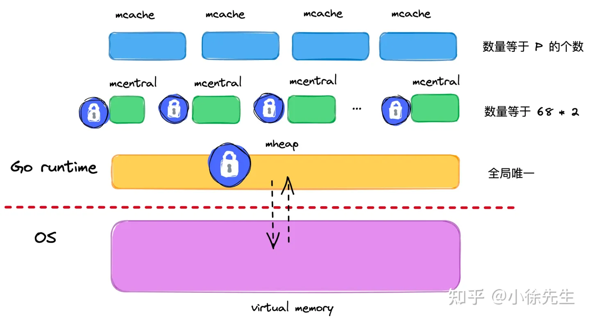
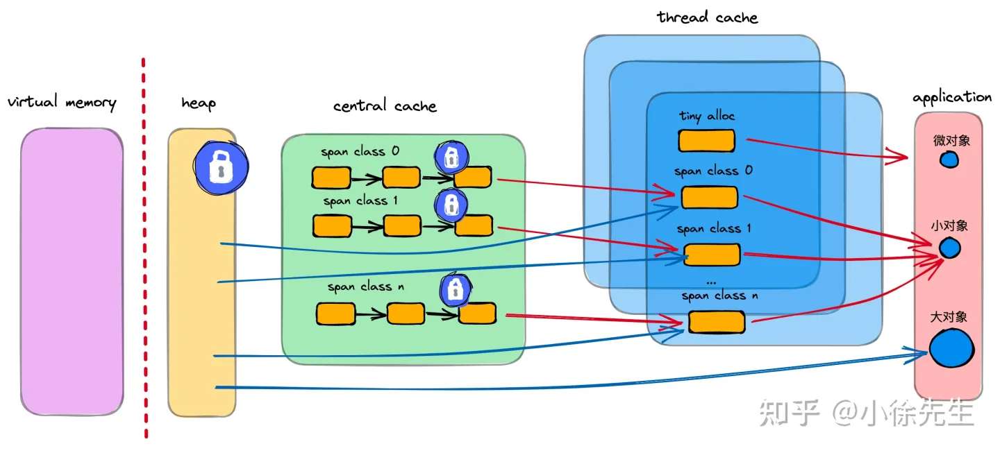

**内存管理**
- [内容](#内容)
  - [内存分配](#内存分配)

# 内容 #
## 内存分配 ##
**内存模型**  

**设计思想**  
- 内存分配算法采用Google的TCMalloc算法，每个线程都会自行维护一个独立的内存池，进行内存分配时优先从该内存池中分配，当内存池不足时才会向加锁向全局内存池申请，减少系统调用并且避免不同线程对全局内存池的锁竞争
- 把内存切分的非常的细小，分为多级管理，以降低锁的粒度
- 回收对象内存时，并没有将其真正释放掉，只是放回预先分配的大块内存中，以便复用。只有内存闲置过多的时候，才会尝试归还部分内存给操作系统，降低整体开销
  
**内存单元mspan**  
- mspan是Golang内存管理的最小单元
- mspan大小是page的整数倍（Go中的page大小为 8KB），且内部的页是连续的（至少在虚拟内存的视角中是这样）
- 每个mspan根据空间大小以及面向分配对象的大小，会被划分为不同的等级
- 同等级的 mspan 会从属同一个 mcentral，最终会被组织成链表，因此带有前后指针（prev、next）
- 由于同等级的 mspan 内聚于同一个 mcentral，所以会基于同一把互斥锁管理
- mspan 会基于 bitMap 辅助快速找到空闲内存块（块大小为对应等级下的 object 大小），此时需要使用到 Ctz64 算法

**线程缓存mcache**  
- mcache 是每个 P 独有的缓存，因此交互无锁
- mcache 将每种 spanClass 等级的 mspan 各缓存了一个，总数为 2（nocan 维度） * 68（大小维度）= 136
- mcache 中还有一个为对象分配器 tiny allocator，用于处理小于 16B 对象的内存分配

**中心缓存mcentral**  
- 每个 mcentral 对应一种 spanClass
- 每个 mcentral 下聚合了该 spanClass 下的 mspan
- mcentral 下的 mspan 分为两个链表，分别为有空间 mspan 链表 partial 和满空间 mspan 链表 full
- 每个 mcentral 一把锁

**全局堆缓存mheap**  
- 以页（8KB）为单位，作为最小内存存储单元
- 负责将连续页组装成 mspan
- 全局内存基于 bitMap 标识其使用情况，每个 bit 对应一页，为 0 则自由，为 1 则已被 mspan 组装
- 通过 heapArena 聚合页，记录了页到 mspan 的映射信息
- 是 mcentral 的持有者，持有所有 spanClass 下的 mcentral，作为自身的缓存
- 内存不够时，向操作系统申请，申请单位为 heapArena（64M）

**分配对象**  
- 微对象 (0, 16B) 先使用线程缓存上的微型分配器，再依次尝试线程缓存、中心缓存、堆分配内存；
- 小对象 [16B, 32KB] 依次尝试线程缓存、中心缓存、堆分配内存；
- 大对象 (32KB, +∞) 直接尝试堆分配内存