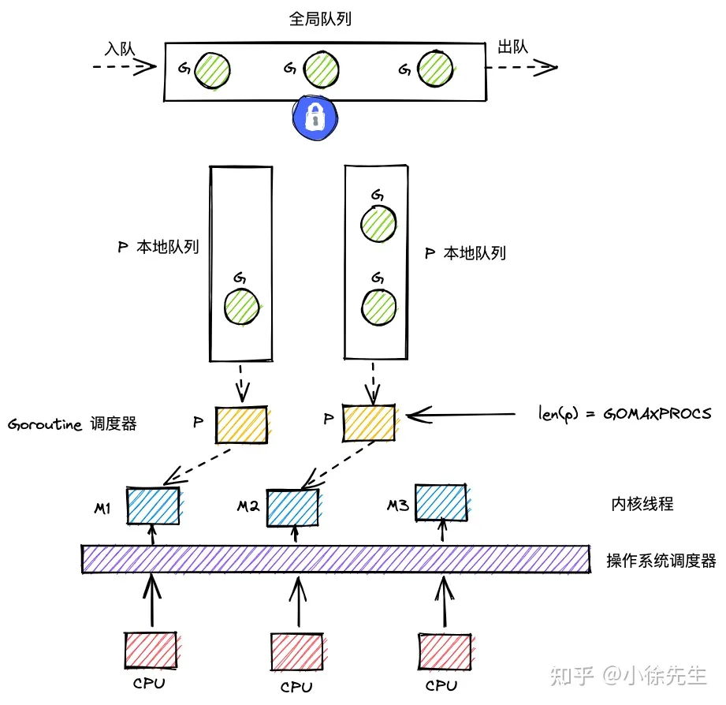

**调度**  
- [内容](#内容)
  - [GMP](#gmp)

# 内容 #
## GMP ##

- M是线程的抽象；G 是 goroutine；P 是承上启下的调度器
- M调度G前，需要和P绑定
- 全局有多个M和多个P，但同时并行的G的最大数量等于P的数量
- G的存放队列有三类：P的本地队列；全局队列；和wait队列
- M调度G时，优先取P本地队列，其次取全局队列，最后取wait队列；这样的好处是，取本地队列时，可以接近于无锁化，减少全局锁竞争；
- 为防止不同P的闲忙差异过大，设立work-stealing机制，本地队列为空的P可以尝试从其他P本地队列偷取一半的G补充到自身队列.