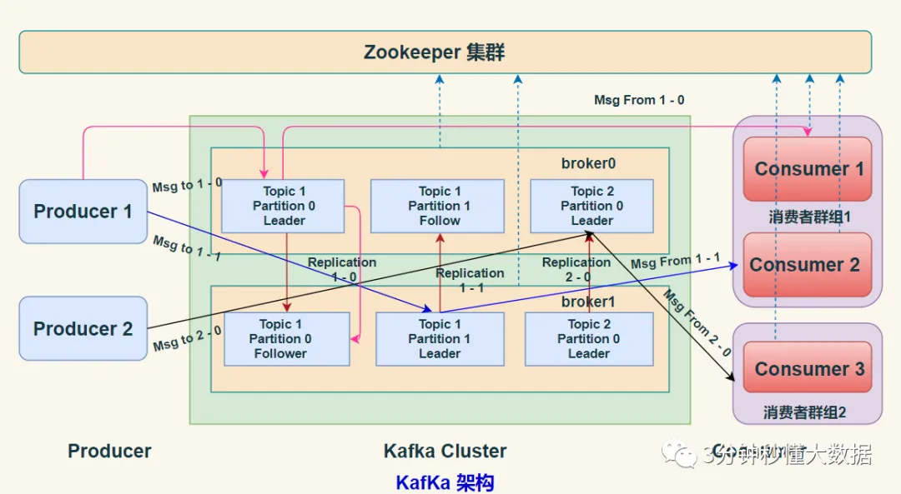

**Kafka**
- [定义](#定义)
- [使用](#使用)
  - [基础](#基础)
  - [读写](#读写)
  - [存储](#存储)
  - [常见问题](#常见问题)

# 定义 #
Kafka是一个分布式事件流平台

# 使用 #
## 基础 ##


```
概念
- Zookeeper  保存 broker 集群元数据和消费者信息(偏移量)
- Producer  生产者负责创建消息，将消息发送到 Broker
- Broker: 一个独立的 Kafka 服务器被称作 Broker，Broker 负责接收来自生产者的消息，为消息设置偏移量，并将消息存储在磁盘。Broker 为消费者提供服务，对读取分区的请求作出响应，返回已经提交到磁盘上的消息
- Consumer  消费者负责从 Broker 订阅并消费消息。
- Consumer Group  一个消费者组可以包含一个或多个 Consumer
- Topic  Kafka 中的消息 以 Topic 为单位进行划分
- Partition  一个 Topic 可以细分为多个分区，每个分区只属于单个主题。同一个主题下不同分区包含的消息是不同的，分区在存储层面可以看作一个可追加的 日志（Log）文件，消息在被追加到分区日志文件的时候都会分配一个特定的 偏移量（offset）
- Offset  Offset 是消息在分区中的唯一标识，Kafka 通过它来保证消息在分区内的顺序性，不过 offset 并不跨越分区，也就是说，Kafka保证的是分区有序性而不是主题有序性
- Replication  副本是 Kafka 保证数据高可用的方式，Kafka 同一 Partition 的数据可以在多 Broker 上存在多个副本，通常只有主副本对外提供读写服务，当主副本所在 Broker 崩溃或发生网络异常，Kafka 会在 Controller 的管理下会重新选择新的 Leader 副本对外提供读写服务
- Record  实际写入 Kafka 中并可以被读取的消息记录。每个 record 包含了 key、value 和 timestamp
- Leader  每个分区多个副本的 "主" Leader，生产者发送数据的对象，以及消费者消费数据的对象都是 Leader。
- Follower  每个分区多个副本中的"从" Follower,实时从 Leader 中同步数据，保持和 Leader 数据的同步。Leader 发生故障时，某个 Follower 会成为新的 Leader。

特点
- 高吞吐量、低延迟  每秒可以处理几十万条消息，它的延迟最低只有几毫秒
- 可扩展  每个主题(Topic)包含多个分区(Partition)，主题中的分区可以分布在不同的主机(Broker)中
- 高可用  某个节点宕机，Kafka集群能够正常工作

高性能
- 批量发送
- 消息压缩
- 操作系统的页缓存
- 磁盘顺序写入
- 零拷贝

消息有序
- kafka只保证同一个分区内的消息有序
  - 生产有序  生产者顺序写入
  - 消费有序  同一个分区内的消息只能被一个Group里的一个Consumer消费
- 超时重试时，不一定有序
  - 限制最大未完成请求，前一条消息未 ack，下一条消息不会发送
```

## 读写 ##
```
生产者
- 写入流程
  - Producer先从Zookeeper找到该Partition的Leader
  - Producer将消息发送给该Leader
  - Leader将消息写入本地Log
  - Followers从Leader中Pull消息，写入本地Log后向Leader发送Ack
  - Leader收到所有ISR中的Replication的Ack后，向Producer发送Ack
- 分区
  - 目的
    - 方便扩展  一个Topic可以有多个Partition，可以适应任意大小的数据
    - 提高并发  以Partition为单位读写
  - 选择
    - 指明Partition的情况下，直接使用
    - 没有指明Partition但有Key的情况下，将Key的Hash值与Topic的Partition数进行取余得到Partition  
    - 既没有指明Partition值又没有Key值的情况下，第一次调用时随机生成一个整数(后面每次调用在这个整数上自增)，将这个值与Topic可用的Partition总数取模得到Partition
- 可靠性
  - 消息确认机制(ack应答) 
    - 0  Producer不等待Broker的Ack
    - 1  Producer等待Broker的Ack，Partition的Leader写入成功后返回Ack
    - -1  Producer等待Broker的Ack，Partition的Leader和Follower全部写入成功后才返回Ack
- 幂等性
  - 单会话单分区  
    幂等性生产者，Broker会为每个(Topic, Partition)保存一个(PID, SeqNumber)
  - 多分区多会话 
    事务性生产者

消费者
- 模式
  - Kafka消费者采用Pull拉模式从Broker中消费数据  
  - Pull模式则可以根据Consumer的消费能力以适当的速率消费消息
  - 消费者可能会陷入循环中，一直返回空数据。为了避免这种情况，我们在我们的拉请求中有参数，允许消费者请求在等待数据到达的长轮询中进行阻塞
- 消费者组
  - 消费者是以Consumer Group消费者组的方式工作，由一个或者多个消费者组成一个组，共同消费一个Topic  
  - 每个Partition在同一时间只能由Group中的一个Consumer读取，但是多个Group可以同时消费这个Partition
- 分区分配
  - 策略
    - 轮询(Round Robin)
      - 实现  对主题和分区进行排序，根据消费者进行轮询
      - 适用场景  适用于消费者组中消费者订阅的主题相同的情况
    - 范围(Range)
      - 实现  计算每个Consumer可以消费的分区个数，然后按照顺序将指定个数范围的分区分配给各个Consumer
    - Sticky(粘性)
      - 分区的分配尽可能均匀
      - 分区的分配尽可能与上次分配的保持相同
  - 消费者数量大于分区数量
    多出来的消费者会处于空闲状态，继续与Broker保持心跳，当其中一个消费者离开消费组后，其他消费者才会重新进行分区分配
  - 再平衡
    - 组成员数发生变更
    - 订阅主题的分区数发生变更
    - 订阅主题发生变更
  - 消费过的消息如何再消费
    - 重设offset
- 消费模式
  - at most once(最多一次) 保证每一条消息 commit 成功之后，再进行消费处理，消息可能会丢失，但不会重复
  - at least once(至少一次)  保证每一条消息处理成功之后，再进行commit。消息不会丢失，但可能会重复
  - exactly once(精确一次)  消息只会处理一次，不丢失也不会重复

服务节点
- 副本
  - 目的  实现故障自动转移
  - 分类
    - ISR  和Leader保持同步进度的Follower
    - OSR  和Leader不保持同步进度的Follower
    - AR  所有的Follower
  - 判断
    - Follower拉取数据时，会上报自己的LEO，Leader对比自己的的LEO与Follower的LEO，相等时更新lastCaughtUpTimeMs，Leader定期计算当前时间Now减去Follower的LastCaughtUpTimeMs大于replica.log.time.max.ms，ISR就会加入OSR
    - Follower的LEO等于Leader的HW的时候，OSR会加入ISR
  - 故障处理
    - Follower故障
      Follower发生故障后会被临时踢出ISR，待该Follower恢复后，将Log文件高于HW的部分截取掉，从HW开始向Leader进行同步。 
    - Leader故障
      Leader发生故障之后，会从ISR中选出一个新的Leader，其余的Follower会先将各自的Log文件高于HW的部分截掉，然后从新的Leader同步数据  
  - 刷盘机制
    - 配置
      - log.flush.interval.messages  //写入多少消息刷盘一次
      - log.flush.interval.ms  //间隔多长时间刷盘一次
      - log.flush.scheduler.interval.ms  //多长时间进行一次检查
    - 操作系统刷新Page Cache

事务
- 保持会话状态
- 保证操作原子性
```

## 存储 ##
```
文件结构
- 划分
  一个topic下有多个partition，一个partition下有多个segment文件
- segment
  - 文件结构
    - *.log  
      baseOffset | batchLength | records
    - *.index  
      offset | position
    - *.timeindex
      timestamp | offset 
  - 分段策略
    - 按数据大小(默认是1GB)  `log.segment.bytes`  
    - 按数据时间(默认7天)  `log.segment.ms`  

数据清理
可以针对主题和分区设置，启用清理 `log.cleaner.enable=true`  
- 策略
  - 删除
    - 启用删除策略  `log.cleanup.policy=delete`
    - 清理超过指定时间前的数据  `log.retention.hours=16`  
    - 清理超过指定大小前的数据  `log.retention.bytes=1073741824`  
  - 压缩  
    只保留每个key最后一个版本的数据
    - 启用压缩策略  `log.cleanup.policy=compact` 
    - segment必须先roll(关闭)
```

## 常见问题 ##
```
消息积压
- 优化消费性能
- 增加分区，增加消费者
```

学习资料  
[官网](https:/*/kafka.apache.org/)  
[真的，Kafka入门一篇文章就够了](https://juejin.cn/post/6844903495670169607)  
[kafka是怎么实现顺序写磁盘的](https://www.zhihu.com/question/63408317/answer/3058280249)  
[kafka-producer源码分析](https://github.com/Raray-chuan/xichuan_note/blob/main/docs/big-data/kafka/kafka-producer%E6%BA%90%E7%A0%81%E5%88%86%E6%9E%90.md)  
[干货总结！Kafka 面试大全（万字长文，37 张图，28 个知识点](https://mp.weixin.qq.com/s/O_1ztfA8CLcYXLdxTa7tgw)