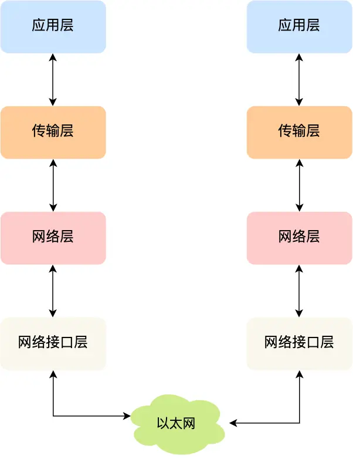

**计算机网络**
- [定义](#定义)
- [内容](#内容)
  - [网络分层](#网络分层)
  - [请求解析过程](#请求解析过程)
  - [网络包收发过程](#网络包收发过程)

# 定义 #
在不同设备间进行通信

# 内容 #
## 网络分层 ##
**架构**  
 

**结构**  

**应用层**  
实现应用间通信(message)

**运输层**  
实现进程间通信(segment)

**网络层**  
实现网络间通信(packet)

**链路层**  
实现设备间通信(frame)

**物理层**  
发送、接收、传输电信号

## 请求解析过程 ##
**流程**  
1.解析请求，生成请求消息  
2.生成TCP数据包  
3.DNS查询，找到IP地址  
4.生成IP数据包  
5.ARP解析，获取MAC地址    
6.生成MAC数据包  
7.网卡驱动数字信号转换成电信号  
8.网卡发送数据  
9.交换机进行转发  
10.路由器进行路由 
**数据包**  

## 网络包收发过程 ##