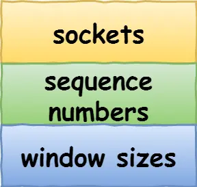

**TCP**
- [定义](#定义)
- [内容](#内容)

# 定义 #
```
面向连接、可靠的、基于字节流的传输层通信协议
```

# 内容 #
```
头部格式
- 源端口号
- 目标端口号
- 序列号 当前数据包编号
- 确认应答号 下一次期望收到的序列号
- 控制位
  - SYN 建立连接
  - ACK 确认应答
  - FIN 断开连接
  - RST 强制断开连接

连接
- Socket 由IP地址和端口号组成
- 序列号 用来解决乱序问题等
- 窗口大小 用来做流量控制

三次握手
流程 
- 服务端(CLOSED状态)主动监听端口(LISTEN状态)  
- 客户端(CLOSED状态)发送SYN报文(SYN_SENT状态)  
- 服务端(Listend状态)发送SYN_ACK报文(SYN_RCVD状态)  
- 客户端(SYN_SENT状态)发送ACK报文(ESTABLISHED状态)  
- 服务端(SYN_RVCD状态)收到ACK报文(ESTABLISHED状态)  

为什么是三次  
- 避免历史连接
- 避免重复连接
- 同步双方初始序列号

握手丢失
- 第一次握手丢失  
客户端超时重传SYN报文，达到最大重传次数，等待一段时间，客户端断开连接
- 第二次握手丢失  
客户端超时重传SYN报文，达到最大重传次数，等待一段时间，客户端断开连接  
服务端超时重传SYN-ACK报文，达到最大重传次数，等待一段时间，服务端断开连接
- 第三次握手丢失  
服务端超时重传SYN-ACK报文，达到最大重传次数，等待一段时间，服务端断开连接

队列
- 半连接队列，也称syn队列
- 全连接队列，也称accept队列  
流程  
- 当服务端接收到客户端的 SYN 报文时，会创建一个半连接的对象，然后将其加入到内核的「 SYN 队列」
- 接着发送 SYN + ACK 给客户端，等待客户端回应 ACK 报文
- 服务端接收到 ACK 报文后，从「 SYN 队列」取出一个半连接对象，然后创建一个新的连接对象放入到「 Accept 队列」
- 应用通过调用 accpet() socket 接口，从「 Accept 队列」取出连接对象。
SYN攻击  
把TCP半连接队列打满，这样当TCP半连接队列满了，后续再在收到SYN报文就会丢弃，导致客户端无法和服务端建立连接
避免SYN攻击方式
- 调大netdev_max_backlog，网卡接收更多的数据包
- 增大TCP半连接队列
- 开启tcp_syncookies，不使用syn队列
- 减少SYN+ACK重传次数，尽早断开连接

四次挥手
- 客户端(ESTABLISHED状态)发送FIN报文(FIN_WAIT_1状态)  
- 服务端(ESTABLISHED状态)发送ACK报文(CLOSED_WAIT状态)  
- 客户端(FIN_WAIT_1状态)接收ACK报文(FIN_WAIT_2状态)  
- 服务端(CLOSED_WAIT状态)发送FIN报文(LAST_ACK状态)    
- 客户端(FIN_WAIT_2状态)发送ACK报文(TIME_WAIT状态)  
- 服务端(LAST_ACK状态)接收ACK报文(CLOSED状态)  
- 客户端(TIME_WAIT状态)经过2MSL(CLOSED状态)  

为什么是四次  
四次可以确保客户端和服务端正确关闭连接

挥手丢失
- 第一次挥手丢失  
客户端超时重传FIN报文，达到最大重传次数，等待一段时间，客户端断开连接
- 第二次挥手丢失  
客户端超时重传FIN报文，达到最大重传次数，等待一段时间，客户端断开连接
- 第三次挥手丢失  
  服务端超时重传FIN报文，达到最大重传次数，等待一段时间，服务端断开连接  
  客户端通过close函数关闭连接的，等待tcp_fin_timeout时间，客户端断开连接
- 第四次挥手丢失  
  服务端超时重传FIN报文，达到最大重传次数，等待一段时间，服务端断开连接  
  客户端等待2MSL时长，客户端断开连接

为什么需要TIME_WAIT状态
- 保证被动关闭连接的一方，能被正确的关闭

重传机制
- 超时重传  超过指定的时间(RTO)
  - 数据包丢失
  - 确认应答丢失
- 快速重传 收到三个相同的ACK报文时
- SACK(选择性确认) 只重传丢失的数据
- D-SACK 使用了 SACK 来告诉「发送方」有哪些数据被重复接收了   

滑动窗口
发送方窗口  
- 已发送并收到ACK确认的数据  
- 已发送但未收到ACK确认的数据(SND.UNA)  
- 未发送但总大小在接收方处理范围内(SND.NXT)  
- 未发送但总大小超过接收方处理范围  
接收方窗口  
- 已成功接收并确认的数据  
- 未收到数据但可以接收的数据(RCV.NXT)  
- 未收到数据并不可以接收的数据

流量控制
TCP提供一种机制可以让「发送方」根据「接收方」的实际接收能力控制发送的数据量，这就是所谓的流量控制

拥塞控制
- 慢启动
- 拥塞避免算法
- 拥塞发生
- 快速恢复
```





