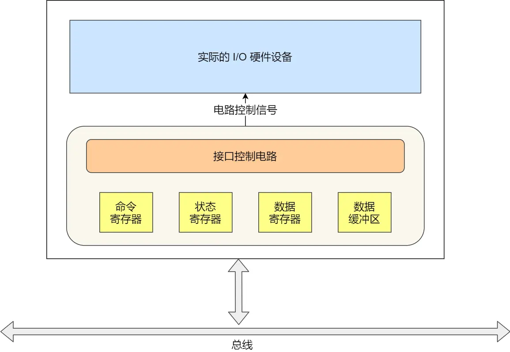
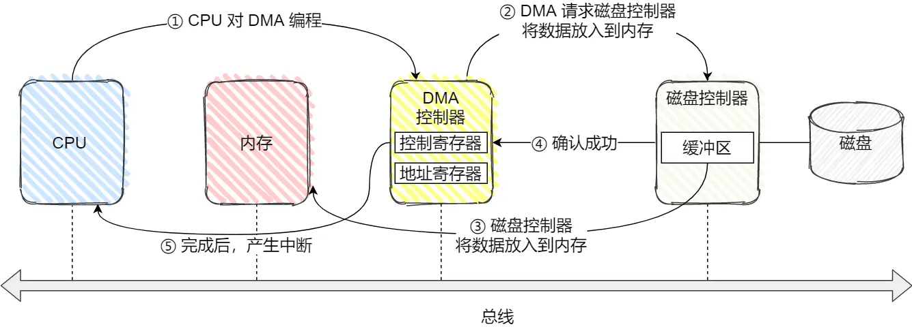
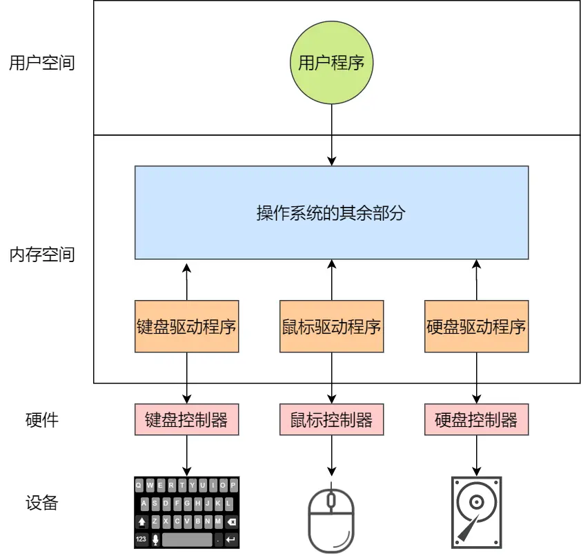

**设备管理**
- [内容](#内容)
  - [设备控制器](#设备控制器)
  - [I/O控制方式](#io控制方式)
  - [驱动程序](#驱动程序)
  - [存储系统I/O软件分层](#存储系统io软件分层)

# 内容 #
## 设备控制器 ##
**结构**  
  

**控制寄存器分类**  
- 数据寄存器
- 命令寄存器
- 状态寄存器

**设备分类**  
- 块设备
- 字符设备 

**CPU与设备的控制寄存器和数据缓冲区通信**
- 端口I/O
- 内存映射I/O
  
## I/O控制方式 ##
**DMA**  
 

## 驱动程序 ##

## 存储系统I/O软件分层 ##
  
