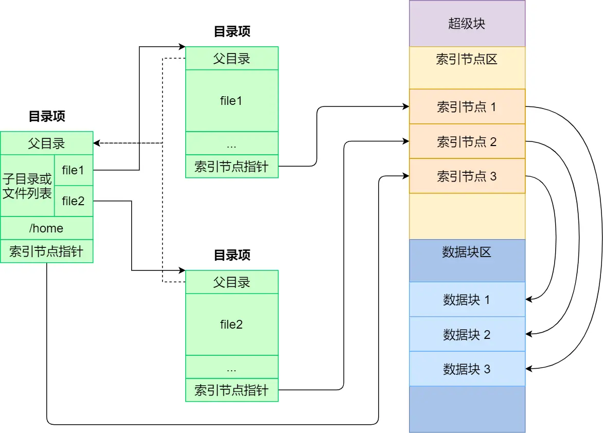

**文件系统**
- [内容](#内容)
  - [基本组成](#基本组成)
  - [虚拟文件系统](#虚拟文件系统)
  - [文件的使用](#文件的使用)
  - [文件的存储](#文件的存储)
  - [空闲空间管理](#空闲空间管理)
  - [文件系统结构](#文件系统结构)
  - [目录的存储](#目录的存储)
  - [软连接和硬连接](#软连接和硬连接)
  - [文件IO](#文件io)

# 内容 #
## 基本组成 ##
**基本组成**  
- 索引节点，也就是inode  
  用来记录文件的元信息
- 目录项，也就是dentry  
  用来记录文件的名字、索引节点指针以及与其他目录项的层级关联关系

**存储结构**  
  

**磁盘存储区域划分**  
- 超级块 用来存储文件系统的详细信息，比如块个数、块大小、空闲块等等
- 索引节点区 用来存储索引节点；
- 数据块区 用来存储文件或目录数据

**加载进内存时机**  
- 超级块 当文件系统挂载时进入内存
- 索引节点区 当文件被访问时进入内存

## 虚拟文件系统 ##
  

**分离**  
- 磁盘的文件系统
- 内存的文件系统
- 网络的文件系统

## 文件的使用 ##
  

**文件描述符**  
- 文件指针
- 文件打开计数器
- 文件磁盘位置
- 访问权限

## 文件的存储 ##
**连续空间存放方式**  

*缺陷*  
- 磁盘空间碎片
- 文件长度不易扩展

**非连续空间存放方式**  
- 链表的方式
  - 隐式链表
  - 显式链接
- 索引的方式
  - 链式索引块
  - 多级索引块

## 空闲空间管理 ##
- 空闲表法
- 空闲链表法
- 位图法

## 文件系统结构 ##
  

## 目录的存储 ##
  

## 软连接和硬连接 ##
**硬连接**  
  

**软连接**  
  

## 文件IO ##
**缓冲与非缓冲I/O**  
- 缓冲I/O，利用的是标准库的缓存实现文件的加速访问，而标准库再通过系统调用访问文件
- 非缓冲I/O，直接通过系统调用访问文件，不经过标准库缓存

**直接与非直接I/O**  
- 直接I/O，不会发生内核缓存和用户程序之间数据复制，而是直接经过文件系统访问磁盘
- 非直接I/O，读操作时，数据从内核缓存中拷贝给用户程序，写操作时，数据从用户程序拷贝给内核缓存，再由内核决定什么时候写入数据到磁盘

**阻塞与非阻塞I/O**  
*阻塞*  

*非阻塞*  

*多路复用*  

*异步*  

**同步与异步I/O**  
  
