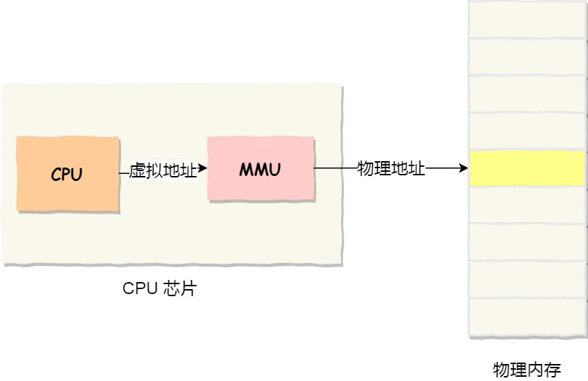
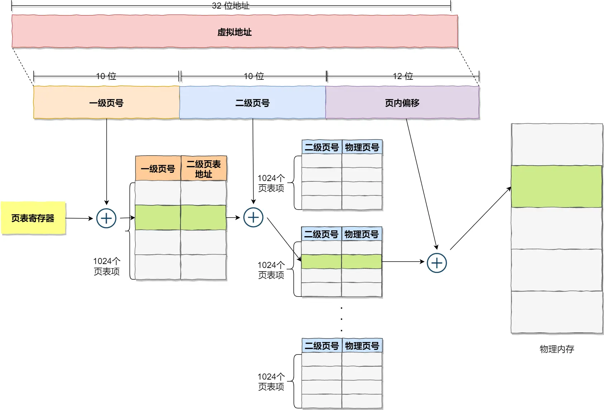

**内存管理**
- [内容](#内容)
  - [虚拟内存](#虚拟内存)
  - [内存分段](#内存分段)
  - [内存分页](#内存分页)

# 内容 #
## 虚拟内存 ##
**为什么要有虚拟内存**  
隔离进程

**实现**  

## 内存分段 ##  
**组成**  
- 段选择因子
- 段内偏移量

**问题**  
- 内存碎片化
- 内存交换效率低

## 内存分页 ##
**组成**  
- 页号
- 页内偏移

**问题**  
- 页表占用空间大
 
**多级页表**  
*二级分页*  

*四级分页*  

*TLB*  
存放程序最常访问的页表项
