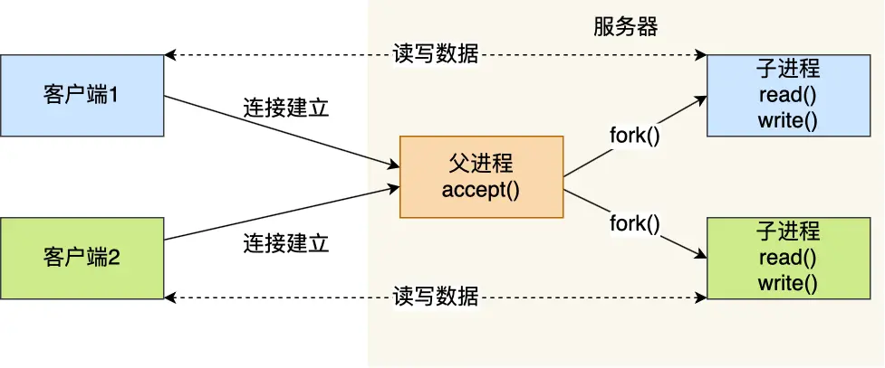
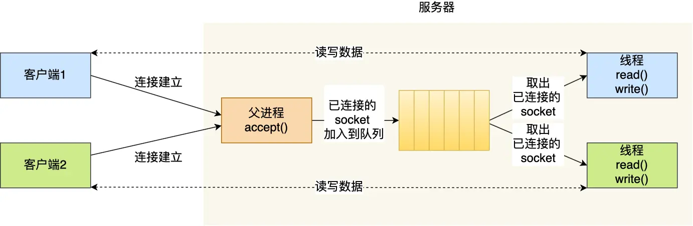
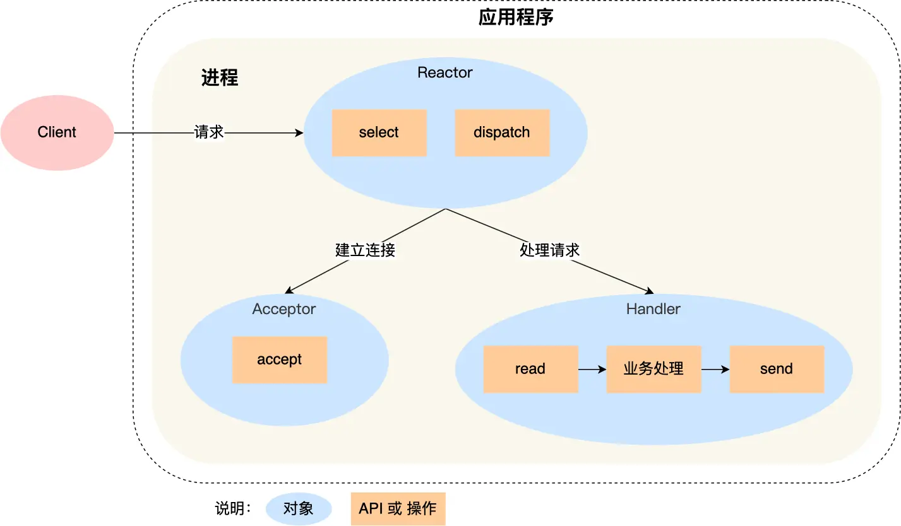
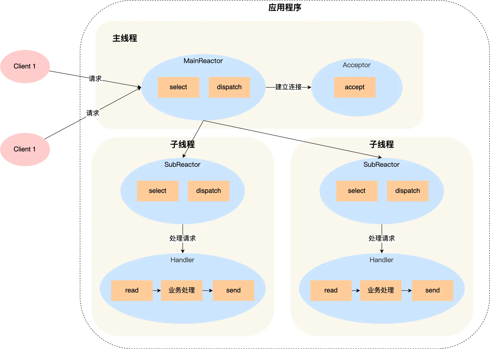
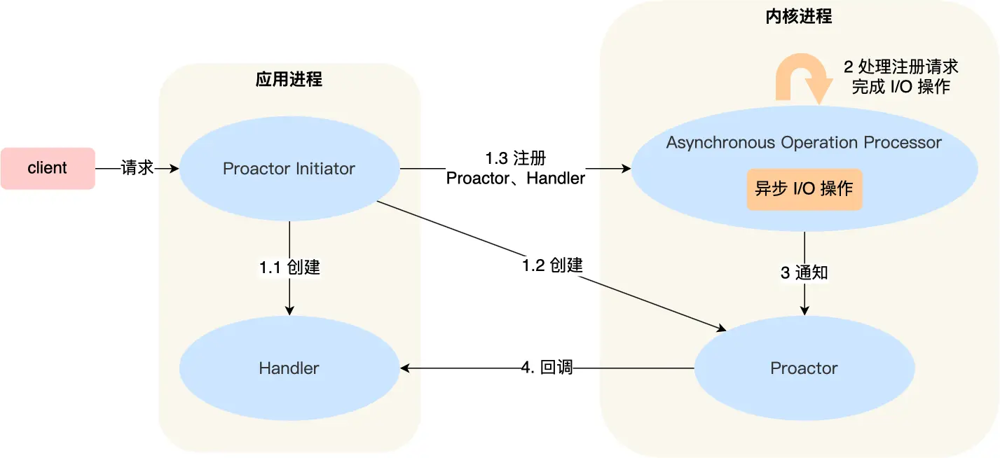

**网络系统**
- [内容](#内容)
  - [IO](#io)
  - [文件传输](#文件传输)
  - [大文件传输](#大文件传输)
  - [I/O多路复用](#io多路复用)
  - [高性能网络模式](#高性能网络模式)
    - [Reactor](#reactor)
    - [Proactor](#proactor)

# 内容 #
## IO ##
**直接IO**  
  

**DMA**  
  

## 文件传输 ##
**read+write**  

**mmap+write**  

**sendfile+dma**  

**sendfile+sg-dma**  

## 大文件传输 ##
**异步IO+直接IO**  

## I/O多路复用 ##
**多进程**  

**多线程**  

**多路复用**  

## 高性能网络模式 ##
### Reactor ###  
Reactor 是非阻塞同步网络模式，感知的是就绪可读写事件

**单Reactor单进程/单线程**  

**单Reactor多线程/多进程**  

**多Reactor多线程/多进程**  

### Proactor ###
Proactor 是异步网络模式， 感知的是已完成的读写事件  

