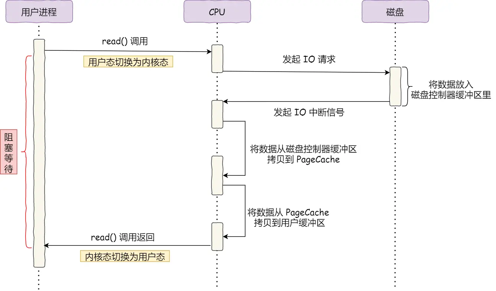
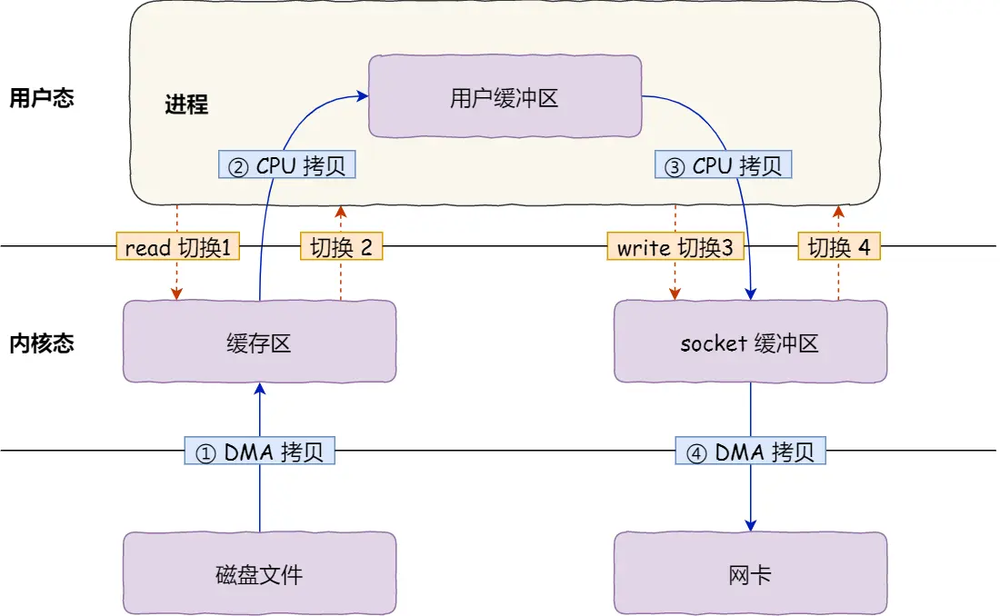
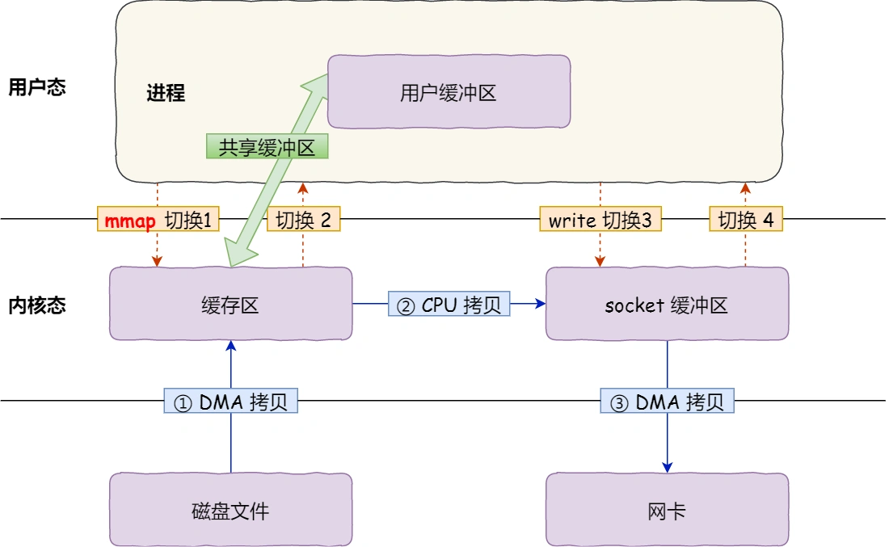
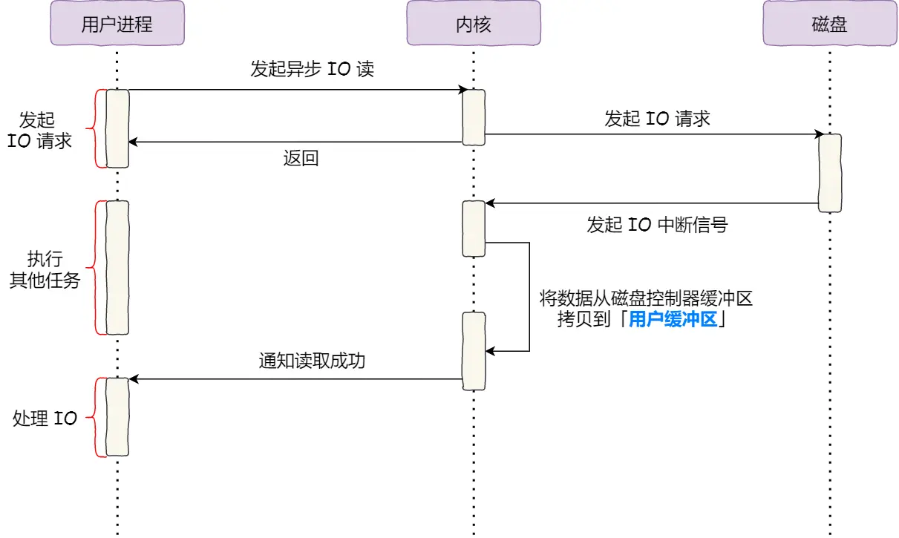

**网络系统**
- [内容](#内容)
  - [IO](#io)
  - [文件传输](#文件传输)
  - [大文件传输](#大文件传输)

# 内容 #
## IO ##
**直接IO**  
  

**DMA**  
  

## 文件传输 ##
**read+write**  

**mmap+write**  

**sendfile+dma**  

**sendfile+sg-dma**  

## 大文件传输 ##
**异步IO+直接IO**  

