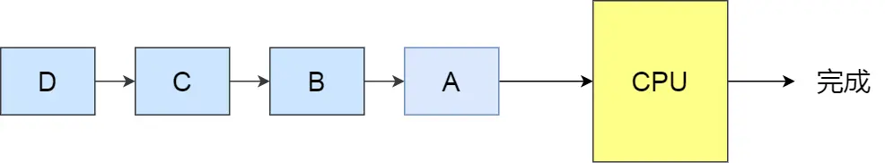
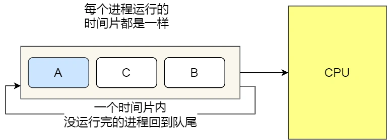

**调度算法**
- [内容](#内容)
  - [进程调度算法](#进程调度算法)
  - [内存页面置换算法](#内存页面置换算法)

# 内容 #
## 进程调度算法 ##
**先来先服务**  

**最短作业优先**  
  

**高响应比优先**  

**时间片轮转**  

**最高优先级**  
*优先级分类*  
- 静态优先级 创建进程时候，就已经确定了优先级了，然后整个运行时间优先级都不会变化
- 动态优先级 根据进程的动态变化调整优先级

*算法分类*  
- 非抢占式 当就绪队列中出现优先级高的进程，运行完当前进程，再选择优先级高的进程
- 抢占式 当就绪队列中出现优先级高的进程，当前进程挂起，调度优先级高的进程运行

**多级反馈队列**  
  

## 内存页面置换算法 ##
**最佳页面置换**  
置换在「未来」最长时间不访问的页面

**先进先出**  
选择在内存驻留时间很长的页面进行中置换

**最近最久未使用的**  
选择最长时间没有被访问的页面进行置换

**时钟页面置换**
把所有的页面都保存在一个类似钟面的「环形链表」中，一个表针指向最老的页面  
当发生缺页中断时，算法首先检查表针指向的页面  
如果它的访问位位是 0 就淘汰该页面，并把新的页面插入这个位置，然后把表针前移一个位置  
如果访问位是 1 就清除访问位，并把表针前移一个位置，重复这个过程直到找到了一个访问位为 0 的页面为止  

**最不常用**  
选择「访问次数」最少的那个页面，并将其淘汰
