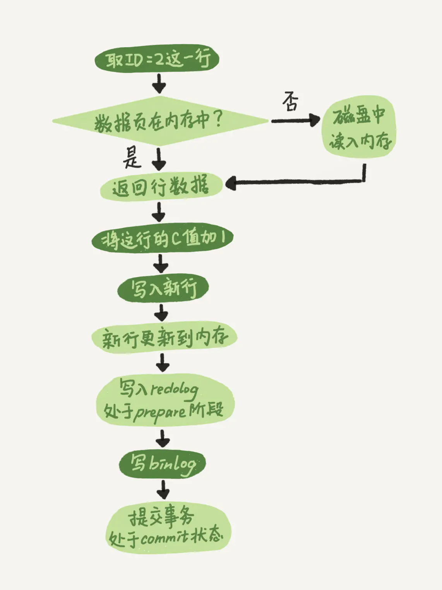

**MySQL**
- [定义](#定义)
- [内容](#内容)
  - [系统](#系统)
  - [数据类型](#数据类型)
  - [SQL](#sql)
  - [查询](#查询)
    - [加速](#加速)
    - [分类](#分类)
    - [优化](#优化)
    - [计划](#计划)
  - [事务](#事务)
  - [存储程序](#存储程序)
  - [存储结构](#存储结构)
    - [行结构](#行结构)
    - [页结构](#页结构)
    - [索引结构](#索引结构)
    - [数据目录](#数据目录)
    - [InnoDB表空间](#innodb表空间)
    - [InnoDB的Buffer Pool](#innodb的buffer-pool)
  - [日志](#日志)
    - [redo日志](#redo日志)
    - [undo日志](#undo日志)
    - [bin日志](#bin日志)
    - [两阶段提交](#两阶段提交)
  - [锁](#锁)

# 定义 #
关系型数据库

# 内容 #
## 系统 ##
```
连接&退出
- 连接
  - mysql --host=主机名 --user=用户名 --password=密码
  - mysql -h主机名  -u用户名 -p密码
- 退出  
  - quit
  - exit
  - \q

存储引擎
- `show engines` 查看存储引擎

变量&状态
- 系统变量
  - `show [global|session] variables [LIKE 匹配的模式]` 查看系统变量
  - `set [global|session] 变量名=值` 设置系统变量
  - `set [@@global|session.] 变量名=值` 设置系统变量
- 系统状态
  - `show [global|session] status [LIKE 匹配的模式]` 查看系统状态

字符集&比较规则
- 查看
  - `show (character set | charset)` 查看字符集
  - `show collation` 查看比较规则
- 比较规则后缀
  | 后缀 | 英文释义 | 描述 |
  | :--: | :--: | :--: |
  | _ai | accent insensitive | 不区分重音 |
  | _as | accent sensitive | 区分重音 |
  | _ci | case insensitive | 不区分大小写 |
  | _cs | case sensitive | 区分大小写 |
  | _bin | binary | 以二进制方式比较 |
- 字符集设置
  - 服务器级别  
    `show variables like 'character_set_server'`
    `show variables like 'collation_server'`
    `set character_set_server='utf8mb4'`
    `set collation_server='utf8mb4_0900_ai_ci'`
  - 数据库级别  
    `show create database 数据库名`
    `create database 数据库名
    [[default] character set 字符集名称]
    [[default] collate 比较规则名称]`
    `alter database 数据库名
    [[default] character set 字符集名称]
    [[default] collate 比较规则名称]`
  - 表级别   
    `show create table 表名
    create table 表名 (列的信息)
    [[default] character set 字符集名称]
    [collate 比较规则名称]`
    `alter table 表名
    [[default] character set 字符集名称]
    [collate 比较规则名称]`
  - 列级别  
    `show create table 表名`
    `CREATE TABLE 表名(
    列名 字符串类型 [CHARACTER SET 字符集名称] [COLLATE 比较规则名称]
    )`
    `ALTER TABLE 表名 MODIFY 列名 字符串类型 [CHARACTER SET 字符集名称] [COLLATE 比较规则名称]`
- 字符集转换过程   
  - 客户端使用操作系统的字符集编码请求字符串，向服务器发送的是经过编码的一个字节串  
  - 服务器将客户端发送来的字节串采用character_set_client代表的字符集进行解码，将解码后的字符串再按照character_set_connection代表的字符集进行编码  
  - 如果character_set_connection代表的字符集和具体操作的列使用的字符集一致，则直接进行相应操作，
  - 否则的话需要将请求中的字符串从character_set_connection代表的字符集转换为具体操作的列使用的字符集之后再进行操作  
  - 将从某个列获取到的字节串从该列使用的字符集转换为character_set_results代表的字符集后发送到客户端  
  - 客户端使用操作系统的字符集解析收到的结果集字节串

查询过程
- 连接管理
  连接器
- 解析与优化
  解析器、优化器、执行器
- 存储引擎
```

## 数据类型 ##
```
整型
| 类型 | 取值范围 | 存储空间 |
| :--- | :--- | :--- | 
| tinyint | 无符号 0~2⁸-1 有符号 -2⁷~2⁷-1 | 1个字节 |
| smallint | 无符号 0~2¹⁶-1 有符号 -2¹⁵~2¹⁵-1 | 2个字节 |
| mediumint | 无符号 0~2²⁴-1 有符号 -2²³~2²³-1 | 3个字节 |
| int | 无符号 0~2³²-1 有符号 -2³¹~2³¹-1 | 4个字节 |
| longint | 无符号 0~2⁶⁴-1 有符号 -2⁶³~2⁶³-1 | 8个字节 |

浮点数  
| 类型 | 取值范围| 存储空间 |
| :--- | :--- | :--- |
| float | M 1~255 D 0~30 | 4个字节 | 
| double | M 1~255 D 0~30 | 8个字节 |  

定点数  
| 类型 | 取值范围 | 存储空间 |
| :--- | :--- | :--- |
| decimal(M,D) | M 1~65 D 0~30 | 取决于M和D 
定点数占用的存储空间
| 组中包含的十进制位数 | 占用存储空间大小 |
| :--: | :--: |
| 1或2 | 1字节 |
| 3或4 | 2字节 |
| 5或6 | 3字节 |
| 7或8或9| 4字节 |

时间和日期
| 类型 | 取值范围 | 存储空间 |
| :--- | :--- | :--- |
| year | 1901~2155 | 1个字节 |
| date | '1000-01-01'~'9999-12-31' | 3个字节 |
| time | '-838:59:59[.000000]'~'838:59:59[.000000]' | 3个字节+小数秒的存储空间 |
| datetime | '1000-01-01 00:00:00[.000000]'~'9999-12-31 23:59:59[.999999]' | 5个字节+小数秒的存储空间 |
| timestamp | '1970-01-01 00:00:01[.000000]'~'2038-01-19 03:14:07[.999999]' | 4个字节+小数秒的存储空间 |
小数位占用的存储空间  
| 保留的小数秒位数 | 额外需要的存储空间要 |
| :--- | :--- |
| 1或2 | 1字节 |
| 3或4 | 2字节 |
| 5或6 | 3字节 |

字符串
| 类型 | 最大长度 | 取值范围 | 存储空间 |
| :--: | :--: | :--: | :--: |
| char(M) | M个字符 | 0~255 | M×W |
| varchar(M) | M个字符 | 1~65535 | L+1或2 |
| tinytext | 2⁸-1个字节 |  | L+1个字节 |
| text | 2¹⁶-1个字节 |  | L+2个字节 |
| mediumtext | 2²⁴-1个字节 |  | L+3个字节 |
| longtext | 2³²-1个字节 |  | L+4个字节 |
| enum | - | - | - |
| set | - | - | - |

二进制
| 类型 | 最大长度 | 取值范围 | 存储空间 |
| :--: | :--: | :--: | :--: |
| bit(M) | M个比特位 | 1~64 | (M+7)/8个字节 | 
| binary(M) | M个字节 | 0~255 | M个字节 | 
| varbinary(M) | M个字节 | 1~65535 | L+1或2个字节 | 
| tinyblob | 2⁸-1个字节 |  | L+1个字节 | 
| blob | 2¹⁶-1个字节 |  | L+2个字节 | 
| mediumblob | 2²⁴-1个字节 |  | L+3个字节 | 
| longblob | 2³²-1个字节 |  | L+4个字节 | 
```

## SQL ##
```
DDL
数据库    
- `show databases` 查看所有库
- `create database [if not exists] 库名` 创建库
- `drop database [if exists] 库名` 删除库
- `use 库名` 选择库
表    
- `show tables [from 库名]` 查看所有表
- `show create table [库名.]表名` 查看表定义
- `[describe|desc|explain|show columns from|show fields form] 表名` 查看表描述
- `create table [if not exists] 表名` 创建表
- `drop table [if exists ]表名` 删除表
- `rename table 旧表名 to 新表名` 修改表名
- `alter table 旧表名 rename to 新表名` 修改表名
- `alter table 表名 add [column] 列名 数据类型 [列的属性] [first|after 列名]` 增加列
- `alter table 表名 drop [column] 列名` 删除列
- `alter table 表名 modify [column] 列名 新数据类型 [新属性] [first|after 列名]` 修改列
- `alter table 表名 change [column] 列名 新列名 新数据类型 [新属性]` 修改列
列    
- `default` 默认值
- `not null` 非空
- `comment` 注释
- `auto_increament` 自增
  - 一个表中最多有一个具有AUTO_INCREMENT属性的列
  - 拥有AUTO_INCREMENT属性的列就不能再通过指定DEFAULT属性来指定默认值
  - 具有AUTO_INCREMENT属性的列必须建立索引  
- `zerofill` 零填充
  - 该列必须是整数类型的
  - 该列必须有unsigned zerofill的属性
  - 该列的实际值的位数必须小于显示宽度  
- `primary key` 主键
- `unique [key] [约束名] (列名)` 唯一键
- `constraint [约束名] foreign key [索引名](列1, 列2, ...) references 父表名 (父列1, 父列2, ...)` 外键


DML
- `insert into 表名 [(列名, 列名)] values (值, 值) [,(值, 值)]` 插入单条|多条数据
- `insert into 表名 select` 插入结果集
- `insert ignore into` 插入忽略错误
- `insert into ... on duplicate key update 列名 = 值|values(列名)` 插入重复值
- `delete from 表名 [where 表达式]` 删除数据
- `update 表名 set 列名=值 [where 表达式]` 更新数据 

DQL
- `select 列名 [as] [别名][, 列名 [as] [别名]] from 表名` 查询单个|多个列
- `select * from 表名` 查询所有列
- `select distinct 列名[, 列名] from 表名` 去除单列|多列的重复结果 
- `limit [开始行,] 限制条数` 限制查询结果条数
- `order by 列名 asc|desc[, 列名 asc|desc]` 按照单列|多列的值进行排序，默认升序

DCL
- `grant 权限 on 库名.表名 to 用户@主机 identified by 密码` 授权
- `revoke 权限 on 库名.表名 to 用户@主机` 回收权限  
```

## 查询 ##
### 加速 ###
```
索引
基本操作  
CREATE TALBE 表名 (
    各种列的信息 ··· , 
    [KEY|INDEX] 索引名 (需要被索引的单个列或多个列)
)

ALTER TABLE 表名 ADD [INDEX|KEY] 索引名 (需要被索引的单个列或多个列)
ALTER TABLE 表名 DROP [INDEX|KEY] 索引名

应用  
- 全值匹配
- 匹配左边的列
- 匹配列前缀
- 匹配范围值
- 用于排序
- 用于分组

注意事项
- 只为用于搜索、排序或分组的列创建索引
- 为列的基数大的列创建索引
- 索引列的类型尽量小
- 可以只对字符串值的前缀建立索引
- 只有索引列在比较表达式中单独出现才可以适用索引
- 为了尽可能少的让聚簇索引发生页面分裂和记录移位的情况，建议让主键拥有AUTO_INCREMENT属性
- 定位并删除表中的重复和冗余索引
- 尽量使用覆盖索引进行查询，避免回表带来的性能损耗

代价  
- 占用额外的存储空间  
- 增删改时需要维护索引值的顺序  

回表  
- 会使用到两个B+树索引，一个二级索引，一个聚簇索引  
- 访问二级索引使用顺序I/O，访问聚簇索引使用随机I/O  
```

### 分类 ###
```
简单查询   
- `select * from`
分组查询  
- `group by 列名 [, 列名] having`
子查询    
- 标量子查询
- 列子查询
- 行子查询
- 表子查询
- exists和not exists子查询
连接查询
- `[inner] [cross] join on` 内连接
- `left join on` 左外连接
- `right join on` 右外连接
组合查询
- `union all` 保留重复记录
- `union` 去除重复记录

运算符
- 算术  `+, -, *, /, %`
- 比较  `\>, \>=, \<, \<=, =, !=, between and, in, not in, is null, is not null, like, not like`
- 逻辑  `and, or, xor`
- 通配  `_, %`

函数
文本  
- `left` 从左边取指定长度的子串
- `right` 从右边取指定长度的子串
- `length` 获取字符串长度
- `upper` 大写格式
- `lower` 小写格式
- `ltrim` 去掉字符串左边空格
- `rtrim` 去掉字符串右边空格
- `substring` 字符串截取
- `concat` 字符串拼接
时间  
- `now` 获取当前日期和时间
- `curdate` 获取当前日期
- `curtime` 获取当前时间
- `date(datetime)` 提取日期
- `date_add(datetime, interval value type)` 添加指定的时间间隔
- `date_sub(datetime, interval value type)` 减去指定的时间间隔
- `datediff(date, date)` 返回两个日期之间的天数
- `date_format(datetime, format)` 格式化显示日期和时间
算术  
- `rand` 随机数
- `mod` 取余
- `abs` 绝对值
- `pi` 圆周率
- `exp` e的指定次方
- `sqrt` 平方根
- `sin` 正弦
- `cos` 余弦
- `tan` 正切
聚集  
- `count` 总数
- `max` 最大值
- `min` 最小值
- `sum` 求和
- `avg` 平均值
```

### 优化 ###
```
查询原理
单表访问方法
- const 主键或者唯一二级索引列通过等值来定位一条记录  
- ref 二级索引列进行等值或者null比较后可能匹配到多条连续的记录  
- ref_or_null 二级索引列的值等于某个常数(包括空)的记录  
- range 范围匹配
- index 扫描整个索引  
- all 全表扫描  

单表索引合并  
- Intersection合并  
- Union合并  
- Sort-Union合并  

连接查询
- 嵌套循环查询(Nested Loop Join)  
- 基于块的嵌套循环查询(Block Nested Loop Join)  

查询成本
成本计算
- IO成本  从磁盘到内存这个加载的过程损耗的时间
- CPU成本  检测记录是否满足对应的搜索条件、对结果集进行排序等这些操作损耗的时间

单表查询成本
- 根据搜索条件，找出所有可能使用的索引  
- 计算全表扫描的代价  
  - 聚簇索引占用的页面数  Data_length / innodb_page_size
  - 该表中的记录数  Rows
- 计算使用不同索引执行查询的代价 
  - 二级索引占用页面数 一个区间就是一个页面
  - 二级索引记录数 区间最左记录和区间最右记录相隔不大于10个页面，那就可以精确统计。否则只沿着区间最左记录向右读10个页面，计算平均每个页面中包含多少记录，然后用这个平均值乘以区间最左记录和区间最右记录之间的页面数量就可以了
  - 回表一条记录算一个页面
- 对比各种执行方案的代价，找出成本最低的那一个  

连接查询成本
连接查询总成本 = 单次访问驱动表的成本 + 驱动表扇出数 x 单次访问被驱动表的成本

单点区间记录计算
- index dive 直接访问索引对应的B+树来计算某个范围区间对应的索引记录条数，小于等于10精确统计，否则估算
- 索引统计 单点区间超过eq_range_index_dive_limit时使用，记录数/基数

InnoDB统计数据收集
存储方式  
- 永久性的统计数据  
- 非永久性的统计数据     

设置
- 通过系统变量`innodb_stats_persistent`设置  
- CREATE TABLE table ENGINE=InnoDB, STATS_PERSISTENT = (1|0)
  ALTER TABLE table ENGINE=InnoDB, STATS_PERSISTENT = (1|0)

更新  
- 定期更新 通过系统变量`innodb_stats_auto_recalc`设置，发生变动的记录数量超过了表大小的10%
- 手动更新 通过命令`ANALYZE TABLE`更新

NULL值处理  
通过系统变量`innodb_stats_method`设置
- nulls_equal 认为所有NULL值都是相等的  
- nulls_unequal 认为所有NULL值都是不相等的  
- nulls_ignored  直接把NULL值忽略掉 

规则优化
条件化简
- 移除不必要的括号
- 常量传递
- 等值传递
- 移除没用的条件
- 表达式计算
- 常量表检测
- 外连接消除

子查询优化
标量子查询、行子查询
- 不相关查询  
  - 单独执行子查询  
  - 再执行外层查询
- 相关查询  
  - 先从外层查询中获取一条记录  
  - 执行子查询  
  - 检测外层查询  

IN子查询优化  
半连接
对于s1表的某条记录来说，我们只关心在s2表中是否存在与之匹配的记录，而不关心具体有多少条记录与之匹配，最终的结果集中只保留s1表的记录  

- 将子查询转换为semi-join
  - Table pullout（子查询中的表上拉） 
  - DuplicateWeedout execution strategy（重复值消除）
  - LooseScan execution strategy（松散扫描）
  - FirstMatch execution strategy（首次匹配）
- 将子查询物化之后再执行查询
- 执行in to exists转换  

表子查询优化  
- 把派生表物化  
- 将派生表和外层的表合并  
```

### 计划 ###
```
explain
- id  查询语句中每出现一个SELECT关键字，就会为它分配一个唯一的id值
- select_type  查询方式
  - SIMPLE  查询语句中不包含UNION或者子查询的查询都算作是SIMPLE类型  
  - PRIMARY  对于包含UNION、UNION ALL或者子查询的大查询来说，它是由几个小查询组成的，其中最左边的那个查询的select_type值就是PRIMARY  
  - UNION  对于包含UNION或者UNION ALL的大查询来说，它是由几个小查询组成的，其中除了最左边的那个小查询以外，其余的小查询的select_type值就是UNION  
  - UNION RESULT  MySQL选择使用临时表来完成UNION查询的去重工作，针对该临时表的查询的select_type就是UNION RESULT  
  - SUBQUERY 子查询是不相关子查询  
  - DEPENDENT SUBQUERY 子查询是相关子查询  
  - DEPENDENT UNION 子查询都依赖于外层查询的话  
  - DERIVED 采用物化的方式执行的包含派生表的查询  
  - MATERIALIZED 将子查询物化之后与外层查询进行连接查询  
- type  表的访问方式
  - system  当表中只有一条记录并且该表使用的存储引擎的统计数据是精确的，比如MyISAM、Memory  
  - const  根据主键或者唯一二级索引列与常数进行等值匹配  
  - eq_rel  在连接查询时，如果被驱动表是通过主键或者唯一二级索引列等值匹配的方式进行访问  
  - ref  普通的二级索引列与常量进行等值匹配  
  - ref_or_null  普通二级索引进行等值匹配查询，该索引列的值也可以是NULL值时  
  - index_merge  使用Intersection、Union、Sort-Union这三种索引合并的方式来执行查询  
  - unique_subquery  子查询可以使用主键进行等值匹配  
  - index_subquery  子查询使用的普通索引进行等值匹配  
  - range  使用索引获取某些范围区间的记录  
  - index  扫描全部的索引记录  
  - all  全表扫描  
- possible_keys  可能用到的索引
- key  实际用到的索引  
- key_len  索引记录的最大长度，由三个部分构成，主要用来区分某个使用联合索引的查询具体用了几个索引列  
  - 索实际占用的存储空间的最大长度
  - 如果该索引列可以存储NULL值，则key_len比不可以存储NULL值时多1个字节
  - 对于变长字段来说，都会有2个字节的空间来存储该变长列的实际长度
- ref  与索引列作等值匹配的内容  
  - const 常数
  - 列名
  - func 函数
- rows  预计需要扫描的行数  
- filtered  驱动表扇出值  
- Extra  额外信息  
  - No tables used  查询语句的没有FROM子句  
  - Impossible WHERE  查询语句的WHERE子句永远为FALSE  
  - No matching min/max row  当查询列表处有MIN或者MAX聚集函数，但是并没有符合WHERE子句中的搜索条件的记录时  
  - Using index  查询列表以及搜索条件中只包含属于某个索引的列，也就是在可以使用索引覆盖的情况下  
  - Using index condition  索引条件下推  
  - Using where  搜索条件需要在server层进行判断时 
  - Using join buffer (Block Nested Loop)  基于块的嵌套循环算法  
  - Not exists  使用左（外）连接时，如果WHERE子句中包含要求被驱动表的某个列等于NULL值的搜索条件，而且那个列又是不允许存储NULL值的  
  - Using intersect(...)、Using union(...)和Using sort_union(...)  使用索引合并的方式执行查询  
  - Zero limit  当LIMIT子句的参数为0时  
  - Using filesort  使用文件排序  
  - Using temporary  使用到了内部临时表  
  - Start temporary, End temporary  查询优化器会优先尝试将IN子查询转换成semi-join，而semi-join又有好多种执行策略，当执行策略为DuplicateWeedout时，也就是通过建立临时表来实现为外层查询中的记录进行去重操作时，驱动表查询执行计划的Extra列将显示Start temporary提示，被驱动表查询执行计划的Extra列将显示End temporary提示  
  - LooseScan  在将In子查询转为semi-join时，如果采用的是LooseScan执行策略，则在驱动表执行计划的Extra列就是显示LooseScan提示  
  - FirstMatch  在将In子查询转为semi-join时，如果采用的是FirstMatch执行策略，则在被驱动表执行计划的Extra列就是显示FirstMatch(tbl_name)提示  

optimizer trace
开启    
`SET optimizer_trace="enabled=on"`

查询
可以到information_schema数据库下的OPTIMIZER_TRACE表中查看完整的优化过程  
- QUERY 表示我们的查询语句  
- TRACE 表示优化过程的JSON格式文本  
- MISSING_BYTES_BEYOND_MAX_MEM_SIZE  由于优化过程可能会输出很多，如果超过某个限制时，多余的文本将不会被显示，这个字段展示了被忽略的文本字节数  
- INSUFFICIENT_PRIVILEGES  表示是否没有权限查看优化过程，默认值是0，只有某些特殊情况下才会是1，我们暂时不关心这个字段的值  

过程
- prepare阶段
- optimize阶段
- execute阶段  
```
<details>
<summary>示例</summary>
<pre>
<code>

```
QUERY: SELECT * FROM s1 WHERE
    key1 > 'z' AND
    key2 < 1000000 AND
    key3 IN ('a', 'b', 'c') AND
    common_field = 'abc'

TRACE: {
  "steps": [
    {
      "join_preparation": {     # prepare阶段
        "select#": 1,
        "steps": [
          {
            "IN_uses_bisection": true
          },
          {
            "expanded_query": "/* select#1 */ select `s1`.`id` AS `id`,`s1`.`key1` AS `key1`,`s1`.`key2` AS `key2`,`s1`.`key3` AS `key3`,`s1`.`key_part1` AS `key_part1`,`s1`.`key_part2` AS `key_part2`,`s1`.`key_part3` AS `key_part3`,`s1`.`common_field` AS `common_field` from `s1` where ((`s1`.`key1` > 'z') and (`s1`.`key2` < 1000000) and (`s1`.`key3` in ('a','b','c')) and (`s1`.`common_field` = 'abc'))"
          }
        ] /* steps */
      } /* join_preparation */
    },
    {
      "join_optimization": {    # optimize阶段
        "select#": 1,
        "steps": [
          {
            "condition_processing": {   # 处理搜索条件
              "condition": "WHERE",
              # 原始搜索条件
              "original_condition": "((`s1`.`key1` > 'z') and (`s1`.`key2` < 1000000) and (`s1`.`key3` in ('a','b','c')) and (`s1`.`common_field` = 'abc'))",
              "steps": [
                {
                  # 等值传递转换
                  "transformation": "equality_propagation",
                  "resulting_condition": "((`s1`.`key1` > 'z') and (`s1`.`key2` < 1000000) and (`s1`.`key3` in ('a','b','c')) and (`s1`.`common_field` = 'abc'))"
                },
                {
                  # 常量传递转换    
                  "transformation": "constant_propagation",
                  "resulting_condition": "((`s1`.`key1` > 'z') and (`s1`.`key2` < 1000000) and (`s1`.`key3` in ('a','b','c')) and (`s1`.`common_field` = 'abc'))"
                },
                {
                  # 去除没用的条件
                  "transformation": "trivial_condition_removal",
                  "resulting_condition": "((`s1`.`key1` > 'z') and (`s1`.`key2` < 1000000) and (`s1`.`key3` in ('a','b','c')) and (`s1`.`common_field` = 'abc'))"
                }
              ] /* steps */
            } /* condition_processing */
          },
          {
            # 替换虚拟生成列
            "substitute_generated_columns": {
            } /* substitute_generated_columns */
          },
          {
            # 表的依赖信息
            "table_dependencies": [
              {
                "table": "`s1`",
                "row_may_be_null": false,
                "map_bit": 0,
                "depends_on_map_bits": [
                ] /* depends_on_map_bits */
              }
            ] /* table_dependencies */
          },
          {
            "ref_optimizer_key_uses": [
            ] /* ref_optimizer_key_uses */
          },
          {
          
            # 预估不同单表访问方法的访问成本
            "rows_estimation": [
              {
                "table": "`s1`",
                "range_analysis": {
                  "table_scan": {   # 全表扫描的行数以及成本
                    "rows": 9688,
                    "cost": 2036.7
                  } /* table_scan */,
                  
                  # 分析可能使用的索引
                  "potential_range_indexes": [
                    {
                      "index": "PRIMARY",   # 主键不可用
                      "usable": false,
                      "cause": "not_applicable"
                    },
                    {
                      "index": "idx_key2",  # idx_key2可能被使用
                      "usable": true,
                      "key_parts": [
                        "key2"
                      ] /* key_parts */
                    },
                    {
                      "index": "idx_key1",  # idx_key1可能被使用
                      "usable": true,
                      "key_parts": [
                        "key1",
                        "id"
                      ] /* key_parts */
                    },
                    {
                      "index": "idx_key3",  # idx_key3可能被使用
                      "usable": true,
                      "key_parts": [
                        "key3",
                        "id"
                      ] /* key_parts */
                    },
                    {
                      "index": "idx_key_part",  # idx_keypart不可用
                      "usable": false,
                      "cause": "not_applicable"
                    }
                  ] /* potential_range_indexes */,
                  "setup_range_conditions": [
                  ] /* setup_range_conditions */,
                  "group_index_range": {
                    "chosen": false,
                    "cause": "not_group_by_or_distinct"
                  } /* group_index_range */,
                  
                  # 分析各种可能使用的索引的成本
                  "analyzing_range_alternatives": {
                    "range_scan_alternatives": [
                      {
                        # 使用idx_key2的成本分析
                        "index": "idx_key2",
                        # 使用idx_key2的范围区间
                        "ranges": [
                          "NULL < key2 < 1000000"
                        ] /* ranges */,
                        "index_dives_for_eq_ranges": true,   # 是否使用index dive
                        "rowid_ordered": false,     # 使用该索引获取的记录是否按照主键排序
                        "using_mrr": false,     # 是否使用mrr
                        "index_only": false,    # 是否是索引覆盖访问
                        "rows": 12,     # 使用该索引获取的记录条数
                        "cost": 15.41,  # 使用该索引的成本
                        "chosen": true  # 是否选择该索引
                      },
                      {
                        # 使用idx_key1的成本分析
                        "index": "idx_key1",
                        # 使用idx_key1的范围区间
                        "ranges": [
                          "z < key1"
                        ] /* ranges */,
                        "index_dives_for_eq_ranges": true,   # 同上
                        "rowid_ordered": false,   # 同上
                        "using_mrr": false,   # 同上
                        "index_only": false,   # 同上
                        "rows": 266,   # 同上
                        "cost": 320.21,   # 同上
                        "chosen": false,   # 同上
                        "cause": "cost"   # 因为成本太大所以不选择该索引
                      },
                      {
                        # 使用idx_key3的成本分析
                        "index": "idx_key3",
                        # 使用idx_key3的范围区间
                        "ranges": [
                          "a <= key3 <= a",
                          "b <= key3 <= b",
                          "c <= key3 <= c"
                        ] /* ranges */,
                        "index_dives_for_eq_ranges": true,   # 同上
                        "rowid_ordered": false,   # 同上
                        "using_mrr": false,   # 同上
                        "index_only": false,   # 同上
                        "rows": 21,   # 同上
                        "cost": 28.21,   # 同上
                        "chosen": false,   # 同上
                        "cause": "cost"   # 同上
                      }
                    ] /* range_scan_alternatives */,
                    
                    # 分析使用索引合并的成本
                    "analyzing_roworder_intersect": {
                      "usable": false,
                      "cause": "too_few_roworder_scans"
                    } /* analyzing_roworder_intersect */
                  } /* analyzing_range_alternatives */,
                  
                  # 对于上述单表查询s1最优的访问方法
                  "chosen_range_access_summary": {
                    "range_access_plan": {
                      "type": "range_scan",
                      "index": "idx_key2",
                      "rows": 12,
                      "ranges": [
                        "NULL < key2 < 1000000"
                      ] /* ranges */
                    } /* range_access_plan */,
                    "rows_for_plan": 12,
                    "cost_for_plan": 15.41,
                    "chosen": true
                  } /* chosen_range_access_summary */
                } /* range_analysis */
              }
            ] /* rows_estimation */
          },
          {
            
            # 分析各种可能的执行计划
            #（对多表查询这可能有很多种不同的方案，单表查询的方案上边已经分析过了，直接选取idx_key2就好）
            "considered_execution_plans": [
              {
                "plan_prefix": [
                ] /* plan_prefix */,
                "table": "`s1`",
                "best_access_path": {
                  "considered_access_paths": [
                    {
                      "rows_to_scan": 12,
                      "access_type": "range",
                      "range_details": {
                        "used_index": "idx_key2"
                      } /* range_details */,
                      "resulting_rows": 12,
                      "cost": 17.81,
                      "chosen": true
                    }
                  ] /* considered_access_paths */
                } /* best_access_path */,
                "condition_filtering_pct": 100,
                "rows_for_plan": 12,
                "cost_for_plan": 17.81,
                "chosen": true
              }
            ] /* considered_execution_plans */
          },
          {
            # 尝试给查询添加一些其他的查询条件
            "attaching_conditions_to_tables": {
              "original_condition": "((`s1`.`key1` > 'z') and (`s1`.`key2` < 1000000) and (`s1`.`key3` in ('a','b','c')) and (`s1`.`common_field` = 'abc'))",
              "attached_conditions_computation": [
              ] /* attached_conditions_computation */,
              "attached_conditions_summary": [
                {
                  "table": "`s1`",
                  "attached": "((`s1`.`key1` > 'z') and (`s1`.`key2` < 1000000) and (`s1`.`key3` in ('a','b','c')) and (`s1`.`common_field` = 'abc'))"
                }
              ] /* attached_conditions_summary */
            } /* attaching_conditions_to_tables */
          },
          {
            # 再稍稍的改进一下执行计划
            "refine_plan": [
              {
                "table": "`s1`",
                "pushed_index_condition": "(`s1`.`key2` < 1000000)",
                "table_condition_attached": "((`s1`.`key1` > 'z') and (`s1`.`key3` in ('a','b','c')) and (`s1`.`common_field` = 'abc'))"
              }
            ] /* refine_plan */
          }
        ] /* steps */
      } /* join_optimization */
    },
    {
      "join_execution": {    # execute阶段
        "select#": 1,
        "steps": [
        ] /* steps */
      } /* join_execution */
    }
  ] /* steps */
}

MISSING_BYTES_BEYOND_MAX_MEM_SIZE: 0

INSUFFICIENT_PRIVILEGES: 1
```
</code>
</pre>
</details>

## 事务 ##
[状态转移](https://raw.githubusercontent.com/chenfeitjpu/computer/master/store/images/mysql/transaction-state.awebp)
```
特性  
- 原子性（Atomicity）
- 隔离性（Isolation）
- 一致性（Consistency）
- 持久性（Durability）

状态  
- 活动的(active)
- 部分提交的(partially committed)
- 失败的(failed)
- 中止的(aborted)
- 提交的(committed)
 
操作
- `BEGIN [WORK]`  开启事务   
- `START TRANSACTION [READ ONLY|READ WRITE] [WITH CONSISTENT SNAPSHOT]`  开启事务  
- `COMMIT [WORK]`  提交事务
- `ROLLBACK [WORK]`  手动中止事务 
- `AUTOCOMMIT` 自动提交
   
保存点
- `SAVEPOINT 保存点名称`  定义
- `ROLLBACK [WORK] TO [SAVEPOINT] 保存点名称` 回滚
- `RELEASE SAVEPOINT 保存点名称` 删除 

并发
问题  
- 脏写 一个事务修改了另一个未提交事务修改过的数据，那就意味着发生了脏写  
- 脏读 一个事务读到了另一个未提交事务修改过的数据，那就意味着发生了脏读   
- 不可重复读 一个事务读到另一个已经提交的事务修改过的数据，并且其他事务每对该数据进行一次修改并提交后，该事务都能查询得到最新值，那就意味着发生了不可重复读  
- 幻读 一个事务先根据某些条件查询出一些记录，之后另一个事务又向表中插入了符合这些条件的记录，原先的事务再次按照该条件查询时，能把另一个事务插入的记录也读出来，那就意味着发生了幻读

隔离级别  
- READ UNCOMMITTED 未提交读
- READ COMMITTED 已提交读   
- REPEATABLE READ 可重复读
- SERIALIZABLE 可串行化

| 隔离级别 | 脏读 | 不可重复读 | 幻读 |  
| :---: | :---: | :---: | :---: |
| READ UNCOMMITTED | Possible | Possible | Possible |
| READ COMMITTED | Not | Possible | Possible | Possible |
| REPEATABLE READ | Not Possible | Not Possible | Possible |
| SERIALIZABLE | Not Possible | Not Possible | Not Possible |

设置隔离级别  
`SET [GLOBAL|SESSION] TRANSACTION ISOLATION LEVEL level`
level: {
    REPEATABLE READ
    READ COMMITTED
    READ UNCOMMITTED
    SERIALIZABLE
}

MVCC
版本链    
记录中包含两个必要的隐藏列  
- trx_id 每次一个事务对某条聚簇索引记录进行改动时，都会把该事务的事务id赋值给trx_id隐藏列
- roll_pointer 每次对某条聚簇索引记录进行改动时，都会把旧的版本写入到undo日志中，然后这个隐藏列就相当于一个指针，可以通过它来找到该记录修改前的信息  
记录每次更新后，都会将旧值放到一条undo日志中，就算是该记录的一个旧版本，随着更新次数的增多，所有的版本都会被roll_pointer属性连接成一个链表，我们把这个链表称之为版本链

ReadView    
- m_ids  表示在生成ReadView时当前系统中活跃的读写事务的事务id列表  
- min_trx_id  表示在生成ReadView时当前系统中活跃的读写事务中最小的事务id，也就是m_ids中的最小值
- max_trx_id  表示生成ReadView时系统中应该分配给下一个事务的id值
- creator_trx_id  表示生成该ReadView的事务的事务id  

访问过程
- 如果被访问版本的trx_id属性值与ReadView中的creator_trx_id值相同，意味着当前事务在访问它自己修改过的记录，所以该版本可以被当前事务访问  
- 如果被访问版本的trx_id属性值小于ReadView中的min_trx_id值，表明生成该版本的事务在当前事务生成ReadView前已经提交，所以该版本可以被当前事务访问  
- 如果被访问版本的trx_id属性值大于或等于ReadView中的max_trx_id值，表明生成该版本的事务在当前事务生成ReadView后才开启，所以该版本不可以被当前事务访问
- 如果被访问版本的trx_id属性值在ReadView的min_trx_id和max_trx_id之间，那就需要判断一下trx_id属性值是不是在m_ids列表中，如果在，说明创建ReadView时生成该版本的事务还是活跃的，该版本不可以被访问；如果不在，说明创建ReadView时生成该版本的事务已经被提交，该版本可以被访问  

生成时机  
- READ COMMITTED  每次读取数据前都生成一个ReadView  
- REPEATABLE READ  在第一次读取数据时生成一个ReadView  
```

## 存储程序 ##
``` 
语法 
- `declare 变量名 数据类型 [default value]` 定义局部变量
- `set name=value` 变量赋值
- `into name, name` 多个变量赋值
- `delimiter` 结束分隔符

if 表达式 then  
elseif 表达式 then  
else  
end if

case 变量
when 值 then
else
end


case
when 布尔表达式 then
else
end


while 表达式 do  
end while

repeat  
until 表达式 end repeat

loop  
end loop

游标
- `declare 游标名 cursor for select` 创建游标 
- `declare continue handler for not found` 事件响应
- `open 游标名` 打开游标  
- `fetch 游标名 into` 移动游标
- `close 游标名` 关闭游标

存储函数
- `show function status [like 函数名]` 查看所有函数
- `show create function 函数名` 查看函数定义
- `create function 函数名(参数名 数据类型, 参数名 数据类型)  
  returns 返回值类型  
  begin  
      函数体内容  
      return
  end`
- `drop function 函数名` 删除函数

存储过程
- `show procedure status [like 存储过程名]` 查看所有存储过程
- `show create procedure 存储过程名` 查看存储过程定义
- `create procedure 存储过程名([in|out|inout]参数名 数据类型)  
  begin  
  end`
- `drop procedure 存储过程名` 删除存储过程

触发器
- `show triggers` 查看所有触发器
- `show create trigger 触发器名` 查看触发器定义
- `create trigger 触发器名  
  {before|after} on {insert|update|delete} on 表名  
  for each row  
  begin  
    {old|new}  
  end` 
- `drop trigger 触发器名` 删除触发器

事件
- `show events` 查看所有事件
- `show create event 事件名` 查看事件定义
- `create event 事件名  
  on schedual  
  {  
    at 某个确定的时间点  
    every 期望的时间间隔 [STARTS datetime][END datetime]  
  }  
  do  
  begin  
  end `
- `drop event 事件名` 删除事件
```

## 存储结构 ##
### 行结构 ###  
[compact行格式](https://raw.githubusercontent.com/chenfeitjpu/computer/master/store/images/mysql/innodb_row_format_compact.webp)

[redundant行格式](https://raw.githubusercontent.com/chenfeitjpu/computer/master/store/images/mysql/innodb_row_format_redundant.webp)

```
行结构 
`show table status like 表名\G`  查看行结构
`create table 表名 (列的信息) row_format=行格式名称`  设置行结构
`alter table 表名 row_format=行格式名称`  修改行结构

InnoDB行结构
compact
变长字段长度列表
- 所有的列都不是变长的数据类型的话，这一部分就不需要有
- 逆序排列  
- 可变字段允许存储的最大字节数(M×W)超过255字节并且真实存储的字节数(L)超过127字节，则使用2个字节，否则使用1个字节  
- 使用字节的第一个二进制位作为标志位，如果该字节的第一个位为0，那该字节就是一个单独的字段长度，如果该字节的第一个位为1，那该字节就是半个字段长度  

NULL值列表  
- 表中没有允许存储 NULL 的列，则 NULL值列表 也不存在了
- 逆序排列  
- NULL值列表必须用整数个字节的位表示


NULL值处理    
- 不存储 

CHAR(M)列的存储格式  
- 当列采用的是定长字符集时，该列占用的字节数不会被加到变长字段长度列表，而如果采用变长字符集时，该列占用的字节数也会被加到变长字段长度列表  
- 变长字符集的CHAR(M)类型的列要求至少占用M个字节

Redundant
字段长度偏移列表  
- 采用两个相邻数值的差值来计算各个列值的长度  
- 偏移量值的第一个比特位作为是否为NULL的依据

NULL值处理  
- 如果存储NULL值的字段是定长类型的，则NULL值也将占用记录的真实数据部分，并把该字段对应的数据使用0x00字节填充  
- 如果该存储NULL值的字段是变长类型的，则不在记录的真实数据处占用任何存储空间

CHAR(M)列的存储格式   
- 占用空间M×W个字节  

Dynamic
格式类似于COMPACT行格式，处理行溢出数据时把所有的字节都存储到其他页面中，只在记录的真实数据处存储其他页面的地址

Compressed
格式类似于Dynamic，采用压缩算法对页面进行压缩

行溢出
一个页一般是16KB，当记录中的数据太多，当前页放不下的时候，会把多余的数据存储到其他页中，这种现象称为行溢出  
对于Compact和Redundant行格式来说，如果某一列中的数据非常多的话，在本记录的真实数据处只会存储该列的前768个字节的数据和一个指向其他页的地址，然后把剩下的数据存放到其他页中
```

### 页结构 ###
[innodb数据页结构](https://raw.githubusercontent.com/chenfeitjpu/computer/master/store/images/mysql/innodb_page.webp)

```
InnoDB数据页结构
目录的生成  
- 将所有正常的记录（包括最大和最小记录，不包括标记为已删除的记录）划分为几个组  
- 每个组的最后一条记录（也就是组内最大的那条记录）的头信息中的n_owned属性表示该记录拥有多少条记录，也就是该组内共有几条记录  
- 将每个组的最后一条记录的地址偏移量单独提取出来按顺序存储到靠近页的尾部的地方

记录分组过程
- 对于最小记录所在的分组只能有 1 条记录，最大记录所在的分组拥有的记录条数只能在 1~8 条之间，剩下的分组中记录的条数范围只能在是 4~8 条之间  
- 初始情况下一个数据页里只有最小记录和最大记录两条记录，它们分属于两个分组  
- 之后每插入一条记录，都会从页目录中找到主键值比本记录的主键值大并且差值最小的槽，然后把该槽对应的记录的n_owned值加1，表示本组内又添加了一条记录，直到该组中的记录数等于8个  
- 在一个组中的记录数等于8个后再插入一条记录时，会将组中的记录拆分成两个组，一个组中4条记录，另一个5条记录。这个过程会在页目录中新增一个槽来记录这个新增分组中最大的那条记录的偏移量  
```

### 索引结构 ###
```
InnoDB索引方案  
- 数据页中用户记录按主键值升序排列  
- 给所有数据页建立一个目录项    

聚簇索引查找过程  
- 确定目录项记录页  
- 通过目录项记录页确定用户记录所在的页  
- 在用户记录的页中定位到具体的记录  

二级索引查找过程  
- 确定目录项记录页  
- 通过目录项记录页确定用户记录所在的页  
- 在用户记录的页中定位到具体的记录  
- 根据主键值去聚簇索引中再查找一遍完整的用户记录  

MyISAM索引结构
- 将表中的记录按照记录的插入顺序单独存储在一个文件中，称之为数据文件。我们可以通过行号或者地址偏移量快速访问到一条记录
- 把索引信息另外存储到一个称为索引文件的另一个文件中
```

### 数据目录 ###
```
基本操作    
`show variables like 'datadir'` 查看数据目录

数据库在文件系统中的表示  
- 在数据目录下创建一个和数据库名同名的子目录  
- 在该与数据库名同名的子目录下创建一个名为db.opt的文件，这个文件中包含了该数据库的各种属性  

数据表在文件系统中的表示
定义  表名.frm  

数据  
innodb  
系统表空间 ibdata1  
独立表空间 表名.ibd
myisam  
数据 表名.MYD 
索引 表名.MYI
```

### InnoDB表空间 ###
[区](https://raw.githubusercontent.com/chenfeitjpu/computer/master/store/images/mysql/extent_xdes_entry.webp)  
[段](https://raw.githubusercontent.com/chenfeitjpu/computer/master/store/images/mysql/segment_inode_entry.webp)  
[独立表空间](https://raw.githubusercontent.com/chenfeitjpu/computer/master/store/images/mysql/table_space_per.webp)  
[系统表空间](https://raw.githubusercontent.com/chenfeitjpu/computer/master/store/images/mysql/table_space_system.webp)  
[FSP_HDR](https://raw.githubusercontent.com/chenfeitjpu/computer/master/store/images/mysql/table_space_page_fsp_hdr.webp)  
[INODE](https://raw.githubusercontent.com/chenfeitjpu/computer/master/store/images/mysql/table_space_page_inode.webp)  
[XDES](https://raw.githubusercontent.com/chenfeitjpu/computer/master/store/images/mysql/table_space_page_xdes.webp)  
[表空间](https://raw.githubusercontent.com/chenfeitjpu/computer/master/store/images/mysql/table_space.webp)  
```
区
概念  
- 表空间被划分为许多连续的区，每个区默认由64个页组成  
- 每256个区划分为一组，每个组的最开始的几个页面类型是固定的就好了  

状体
- 空闲区
- 有剩余空间的碎片区
- 没有剩余空间的碎片区
- 附属于某个段的区

结构
- Segment ID(8字节) 该区所在的段  
- List Node(12字节) 将若干个XDES Entry结构串联成一个链表
- State(4字节) 区的状态
- Page State Bitmap(16字节) 一个区默认有64个页，这128个比特位被划分为64个部分，每个部分2个比特位，对应区中的一个页，这两个比特位的第一个位表示对应的页是否是空闲的，第二个比特位还没有用  

段
概念  
某些零散的页面以及一些完整的区的集合  

分配策略  
- 在刚开始向表中插入数据的时候，段是从某个碎片区以单个页面为单位来分配存储空间的  
- 当某个段已经占用了32个碎片区页面之后，就会以完整的区为单位来分配存储空间  

结构  
- Segment ID 段号  
- NOT_FULL_N_USED NOT_FULL链表中已经使用了多少个页面
- List Base Node 分别为段的FREE链表、NOT_FULL链表、FULL链表定义了List Base Node
- Magic Number 这个值是用来标记这个INODE Entry是否已经被初始化了（初始化的意思就是把各个字段的值都填进去了）。如果这个数字是值的97937874，表明该INODE Entry已经初始化，否则没有被初始化。（不用纠结这个值有啥特殊含义，人家规定的）
- Fragment Array Entry 每个Fragment Array Entry结构都对应着一个零散的页面，这个结构一共4个字节，表示一个零散页面的页号
```


### InnoDB的Buffer Pool ###
[buffer poll](https://raw.githubusercontent.com/chenfeitjpu/computer/master/store/images/mysql/innodb-buffer-pool.awebp)

```
定义   
InnoDB为了缓存磁盘中的页，在MySQL服务器启动的时候就向操作系统申请了一片连续的内存，他们给这片内存起了个名，叫做Buffer Pool  

管理  
- 缓存页的哈希处理 表空间号+页号作为key，缓存页作为value创建一个哈希表  
- free链表的管理 把所有空闲的缓存页对应的控制块作为一个节点放到一个链表中  
- flush链表的管理 凡是修改过的缓存页对应的控制块都会作为一个节点加入到一个链表中  

LRU链表  
问题
- 预读，InnoDB认为执行当前的请求可能之后会读取某些页面，就预先把它们加载到Buffer Pool中  
  - 线性预读，顺序访问了某个区的页面超过系统变量（innodb_read_ahead_threshold）的值，就会触发一次异步读取下一个区中全部的页面到Buffer Pool的请求  
  - 随机预读，如果Buffer Pool中已经缓存了某个区的13个连续的页面，不论这些页面是不是顺序读取的，都会触发一次异步读取本区中所有其的页面到Buffer Pool的请求   
- 全表扫描的查询语句

解决 把LRU链表按照一定比例分成两截  
- 一部分存储使用频率非常高的缓存页，所以这一部分链表也叫做热数据，或者称young区域  
- 另一部分存储使用频率不是很高的缓存页，所以这一部分链表也叫做冷数据，或者称old区域  

优化
- 针对预读的页面可能不进行后续访问情况的优化 
  当磁盘上的某个页面在初次加载到Buffer Pool中的某个缓存页时，该缓存页对应的控制块会被放到old区域的头部  
- 针对全表扫描时，短时间内访问大量使用频率非常低的页面情况的优化
  在对某个处在old区域的缓存页进行第一次访问时就在它对应的控制块中记录下来这个访问时间，如果后续的访问时间与第一次访问的时间在某个时间间隔内，那么该页面就不会被从old区域移动到young区域的头部

- young区域节点频繁移动
  只有被访问的缓存页位于young区域的1/4的后边，才会被移动到LRU链表头部  

刷新脏页到磁盘  
- 从LRU链表的冷数据中刷新一部分页面到磁盘（BUF_FLUSH_LRU）
- 从flush链表中刷新一部分页面到磁盘（BUF_FLUSH_LIST）
- 将LRU链表尾部的一个脏页同步刷新到磁盘（BUF_FLUSH_SINGLE_PAGE）
  
多个Buffer Pool实例  
`innodb_buffer_pool_instances`  设置Buffer Pool实例的个数  
`innodb_buffer_pool_chunk_size`  一个Buffer Pool实例其实是由若干个chunk组成的  
```

## 日志 ##
### redo日志 ###


  

```
背景  
在事务提交完成之前把该事务所修改的所有页面都刷新到磁盘  
- 刷新一个完整的数据页太浪费了
- 随机IO刷起来比较慢

redo日志刷新到磁盘的好处
- redo日志占用的空间非常小
- redo日志是顺序写入磁盘的

结构
- type  日志的类型  
- space ID  表空间ID  
- page number  页号
- data  日志的具体内容

mini-transaction  
- 对底层页面中的一次原子访问的过程称之为一个Mini-Transaction  
- 一个事务可以包含若干条语句，每一条语句其实是由若干个mtr组成，每一个mtr又可以包含若干条redo日志  
- 一个mtr可以包含一组redo日志，在进行崩溃恢复时这一组redo日志作为一个不可分割的整体  

写入
- redo日志都放在了大小为512字节的页中，我们这里把用来存储redo日志的页称为block 
- 在服务器启动时会向操作系统申请了一大片称之为redo log buffer的连续内存空间，翻译成中文就是redo日志缓冲区，我们也可以简称为log buffer
- buf_free 指明后续写入的redo日志应该写入到log buffer中的哪个位置

刷盘时机
- log buffer空间不足时
- 事务提交时
- 将某个脏页刷新到磁盘前，会保证先将该脏页对应的redo日志刷新到磁盘中
- 后台线程不停的刷刷刷
- 正常关闭服务器时
- 做checkpoint时

redo日志文件组
设置
- `innodb_log_group_home_dir`  指定了redo日志文件所在的目录  
- `innodb_log_file_size`  指定了每个redo日志文件的大小  
- `innodb_log_files_in_group`  指定redo日志文件的个数
格式
- 前2048个字节，也就是前4个block是用来存储一些管理信息的  
- 从第2048字节往后是用来存储log buffer中的block镜像的  

Log Sequence Number
- `lsn`  日志序列号，初始值为8704  
- `flushed_to_disk_lsn`  刷新到磁盘中的redo日志量

flush链表中的LSN  
- oldest_modification  某个页面被加载到Buffer Pool后进行第一次修改，那么就将修改该页面的mtr开始时对应的lsn值写入这个属性  
- newest_modification  每修改一次页面，都会将修改该页面的mtr结束时对应的lsn值写入这个属性  
flush链表中的脏页按照修改发生的时间顺序进行排序  

checkpoint  
- 计算一下当前系统中可以被覆盖的redo日志对应的lsn值最大是多少  
- 将checkpoint_lsn和对应的redo日志文件组偏移量以及此次checkpint的编号写到日志文件的管理信息

innodb_flush_log_at_trx_commit
- 0 在事务提交时不立即向磁盘中同步redo日志
- 1 在事务提交时需要将redo日志同步到磁盘
- 2 在事务提交时需要将redo日志写到操作系统的缓冲区中，但并不需要保证将日志真正的刷新到磁盘

崩溃恢复
起点和终点
- 我们只要把checkpoint1和checkpoint2这两个block中的checkpoint_no值读出来比一下大小，哪个的checkpoint_no值更大，说明哪个block存储的就是最近的一次checkpoint信息。这样我们就能拿到最近发生的checkpoint对应的checkpoint_lsn值以及它在redo日志文件组中的偏移量checkpoint_offset  
- 普通block的log block header部分有一个称之为LOG_BLOCK_HDR_DATA_LEN的属性，该属性值记录了当前block里使用了多少字节的空间。对于被填满的block来说，该值永远为512。如果该属性的值不为512，那么就是它了，它就是此次崩溃恢复中需要扫描的最后一个block  

优化
- 使用哈希表 根据redo日志的space ID和page number属性，将同一个页面进行修改的redo日志都放在一起 
- 跳过已经刷新到磁盘的页面  File Header里有一个称之为FIL_PAGE_LSN的属性，该属性记载了最近一次修改页面时对应的lsn值， 该页对应的FIL_PAGE_LSN代表的lsn值肯定大于checkpoint_lsn的值
```

### undo日志 ###
```
每个事务有四个段
- 普通表 insert段
- 普通表 update段
- 临时表 insert段
- 临时表 update段
```

### bin日志 ###
```
作用  
- 用于复制  
- 用于备份 
```

### 两阶段提交 ###


## 锁 ##
```
并发问题
- 读-读  
- 写-写
  脏写  
  - 加锁    
- 读-写或写-读 一个事务进行读取操作，另一个进行改动操作  
  脏读、不可重复读、幻读  
  - 读操作利用多版本并发控制（MVCC），写操作进行加锁
  - 读、写操作都采用加锁的方式  

分类
- 共享锁，S锁
- 独占锁，X锁
兼容情况  
| 兼容性 | X | S |
| :---: | :---: | :---: |
| X | 不兼容 | 不兼容 |
| S | 不兼容 | 兼容 |

锁定读  
- 对读取的记录加S锁 `SELECT ... LOCK IN SHARE MODE`
- 对读取的记录加X锁 `SELECT ... FOR UPDATE`

写操作
- DELETE 隐式删除，加X锁  
- UPDATE
  - 不修改键值，原记录修改 加X锁
  - 不修改键值，新记录修改 彻底删除再添加
  - 修改键值 删除再添加
- INSERT 不加锁  

表级别  
- S锁
- X锁
- IS锁
- IX锁  
| 兼容性 | X | IX | S | IS |
| :---: | :---: | :---: | :---: | :---: |
| X | 不兼容 | 不兼容 | 不兼容 | 不兼容 |
| IX | 不兼容 | 兼容 | 不兼容 | 兼容 |
| S | 不兼容 | 不兼容 | 兼容 | 兼容 |
| IS | 不兼容 | 兼容 | 兼容 | 兼容 |


InnoDB存储引擎中的锁
表级锁
- S锁、 X锁
- IS锁、IX锁
- AUTO-INC锁

行级锁
- Record Locks
- Gap Locks
- Next-Key Locks
- Insert Intention Locks

加锁过程
READ UNCOMMITTED & READ COMMITTED
等值查询
- 聚簇索引，唯一二级索引 
  记录存在直接加锁，不存在不处理
- 普通二级索引
  判断该记录是否满足等值匹配的条件，满足则加锁，然后再去聚簇索引加锁
范围查询
- 聚簇索引
  - 找到第一条记录，加锁
  - 边界判断，不满足释放锁
  - 搜索条件判断，不满足释放锁
  - 继续向后查找
- 二级索引
  - 找到第一条记录，加锁
  - 边界判断，不满足释放锁
  - 索引下推判断，不满足释放锁
  - 搜索条件判断，不满足释放锁
  - 继续向后查找
- 全表扫描
  - 记录依次加锁  

REPEATABLE READ
等值查询
- 聚簇索引，唯一二级索引  
  记录存在加记录锁，不存在加gap锁
- 普通二级索引  
  记录前后加间隙锁
范围查询
- 聚簇索引
  第一条记录加记录锁，其它next-key锁
- 二级索引
  所有记录加next-key锁    