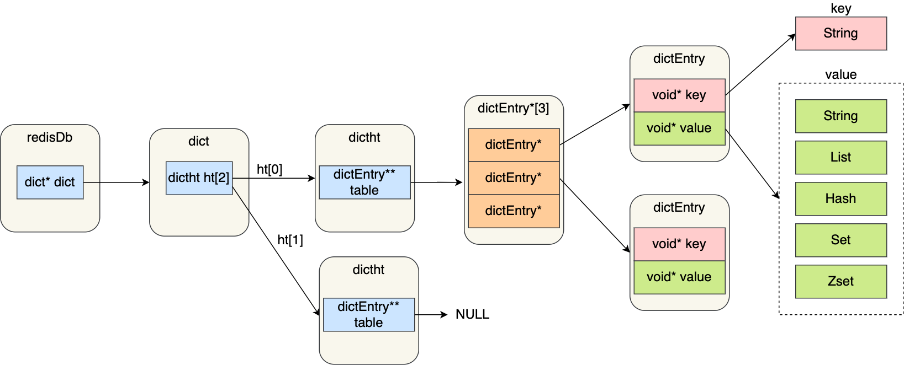
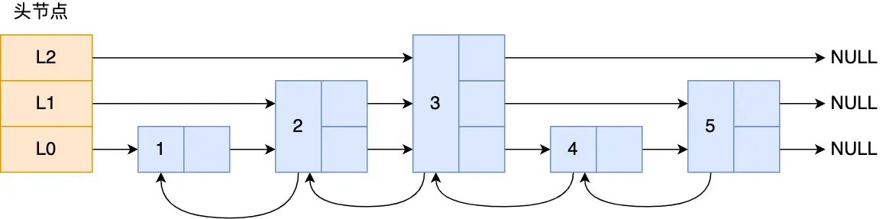

**Redis**
- [定义](#定义)
- [使用](#使用)
  - [特点](#特点)
  - [数据类型](#数据类型)
  - [数据结构](#数据结构)
  - [内存管理](#内存管理)
  - [优化](#优化)
  - [持久化](#持久化)
  - [集群](#集群)
  
# 定义 #
内存数据库，支持持久化，存储的是KV键值对数据

# 使用 #
## 特点  ##
```
为什么快
- 纯内存存储
  数据主要存储在内存中，读写操作直接操作内存
- 高效的数据结构
  Redis提供了多种优化的数据结构（如哈希表、跳表、压缩列表等），这些数据结构在时间和空间上做了平衡
- 简洁高效的通信协议
  使用的是自己设计的RESP协议
- 高效的I/O模型 
  使用I/O多路复用，单个线程可以同时处理多个网络连接上的I/O事件（如读写）
- 执行命令单线程模型
  避免了多线程模型的上下文切换和锁竞争开销

应用场景
- 缓存
- 分布式锁
- 限流
- 消息队列
- 延迟队列
```

## 数据类型 ##
```
key 
- 注意事项
  - key、value上限是512M

string
- 内部实现
  - int  存储8个字节的长整型(-2^63到2^63-1)
  - embstr(sds)  字符串的长度<=44字节，redisObject和SDS内存是连续分配的
  - raw(sds)  redisObject和SDS内存是随机分配的
  - 扩容
    - sds 长度小于 1 MB，那么最后的扩容是按照翻倍扩容来执行的，即 2 倍的newlen
    - sds 长度超过 1 MB，那么最后的扩容长度应该是 newlen + 1MB
- 应用
  缓存、计数、分布式锁

list 
- 内部实现
  - quicklist  
- 应用
  队列、栈

hash
- 内部实现
  - listpack  元素个数<512个且元素大小<64字节
  - hashtable
- 应用  
  - 缓存对象

set
- 内部实现  
  - intset  元素个数<512个且元素都是整数
  - hashtable
- 应用  
  去重、集合计算、随机

sorted set
- 内部实现
  - listpack  元素个数<128个且元素大小<64字节
  - skiplist
- 应用 
  排序

bitmap
- 内部实现
  - string
- 应用  
  签到、登录

hyperloglog
- 内部实现
  - 寄存器数组
- 应用  
  UV计数

geo
- 内部实现
  - sorted set
- 应用  
  打车

stream
- 内部实现
  - stream
- 应用
  消息队列

pub/sub

transaction
服务端原子执行多个命令  
- 注意事项
  - 不保证原子性

pipeline
客户端提供的一种批处理技术，解决多个命令执行时的网络等待
- 客户端批量发送命令
- 服务端批量返回结果

lua
```

## 数据结构 ##
**redisDb**  

  
```
- redisDb  结构体里存放了指向了dict结构的指针  
- dict  结构体里存放了2个哈希表，正常情况下都是用「哈希表1」，「哈希表2」只有在 rehash 的时候才用  
- ditctht  结构里存放了哈希表数组，数组中的每个元素都是指向一个哈希表节点结构（dictEntry）的指针  
- dictEntry  结构里存放了key和value指针，key指向的是String对象，而value则可以指向String对象，也可以指向集合类型的对象，比如List对象、Hash对象、Set对象和Zset对象  
```

**redisObject** 

 
``` 
- type  标识该对象是什么类型的对象(string、list、hash、set、zset)
- encoding  标识该对象使用了哪种底层数据结构，可以使用`object encoding key`命令查看
- ptr  指向底层数据结构的指针  
```

**SDS**  


```
结构
struct __attribute__ ((__packed__)) sdshdr16 {
    uint16_t len;
    uint16_t alloc; 
    unsigned char flags; 
    char buf[];
}
- len  记录了字符串长度    
- alloc  分配给字符数组的空间长度  
- flags  不同容量的sds，sdshdr5、sdshdr8、sdshdr16、sdshdr32和sdshdr64  
- buf[]  字节数组，用来保存实际数据  
```

**listpack**  


```
结构
- encoding  定义该元素的编码类型，会对不同长度的整数和字符串进行编码
- data  实际存放的数据
- len  encoding+data的总长度
```

**quicklist**  


```
结构
typedef struct quicklist {
    //quicklist的链表头
    quicklistNode *head;
    //quicklist的链表尾
    quicklistNode *tail; 
    //所有压缩列表中的总元素个数
    unsigned long count;
    //quicklistNodes的个数
    unsigned long len;       
} 

typedef struct quicklistNode {
    //前一个quicklistNode
    struct quicklistNode *prev; 
    //下一个quicklistNode
    struct quicklistNode *next;
    //quicklistNode指向的压缩列表
    unsigned char *zl;              
    //压缩列表的的字节大小
    unsigned int sz;                
    //压缩列表的元素个数
    unsigned int count;
    ....
}
```

**intset**
```
结构
typedef struct intset {
    //编码方式
    uint32_t encoding;
    //集合包含的元素数量
    uint32_t length;
    //保存元素的数组
    int8_t contents[];
}

整数集合升级
过程
- 当我们将一个新元素加入到整数集合里面，如果新元素的类型比整数集合现有所有元素的类型都要长时，整数集合需要先进行升级，也就是按新元素的类型扩展contents数组的空间大小，然后才能将新元素加入到整数集合里，当然升级的过程中，也要维持整数集合的有序性
- 整数集合升级的过程不会重新分配一个新对象，而是在原本的数组上扩展空间，然后在将每个元素按间隔类型大小分割
好处
- 节省内存资源
```

**跳表**  


```
结构
typedef struct zskiplistNode {
    //Zset 对象的元素值
    sds ele;
    //元素权重值
    double score;
    //后向指针
    struct zskiplistNode *backward;
  
    //节点的level数组，保存每层上的前向指针和跨度
    struct zskiplistLevel {
        struct zskiplistNode *forward;
        unsigned long span;
    } level[];
}
- span 上一个节点到当前节点之前的节点数

typedef struct zskiplist {
    struct zskiplistNode *header, *tail;
    unsigned long length;
    int level;
}
- 头尾节点  便于在O(1)时间复杂度内访问跳表的头节点和尾节点
- 长度  便于在O(1)时间复杂度获取跳表节点的数量
- 最大层数  便于在O(1)时间复杂度获取跳表中层高最大的那个节点的层数量

查询过程
- 如果当前节点的权重小于要查找的权重时，跳表就会访问该层上的下一个节点
- 如果当前节点的权重等于要查找的权重时，并且当前节点的SDS类型数据小于要查找的数据时，跳表就会访问该层上的下一个节点
- 下一个节点为空时，跳表就会使用目前遍历到的节点的level数组里的下一层指针，然后沿着下一层指针继续查找

层数设置
跳表在创建节点时候，会生成范围为[0-1]的一个随机数，如果这个随机数小于等于0.25（相当于概率25%），那么层数就增加1层，然后继续生成下一个随机数，直到随机数的结果大于0.25结束，最终确定该节点的层数

为什么用跳表而不用平衡树
- 范围查找，平衡二叉树无法直接查询，跳表直接遍历
- 结构调整，跳表的插入和删除只需要修改相邻节点的指针，平衡树的插入和删除操作可能引发子树的调整
```

**哈希表**  


```
结构
typedef struct dictht {
    //哈希表数组
    dictEntry **table;
    //哈希表大小
    unsigned long size;  
    //哈希表大小掩码，用于计算索引值
    unsigned long sizemask;
    //该哈希表已有的节点数量
    unsigned long used;
}

typedef struct dictEntry {
    //键值对中的键
    void *key;

    //键值对中的值
    union {
        void *val;
        uint64_t u64;
        int64_t s64;
        double d;
    } v;
    //指向下一个哈希表节点，形成链表
    struct dictEntry *next;
}
- 缺点
  哈希冲突加剧，导致查询性能降低
- rehash
  - 条件
    - 当负载因子大于等于1，并且Redis没有在执行bgsave命令或者bgrewiteaof命令，也就是没有执行RDB快照或没有进行AOF重写的时候，就会进行rehash操作
    - 当负载因子大于等于5，此时说明哈希冲突非常严重了，不管有没有有在执行RDB快照或AOF重写，都会强制进行rehash操作
  - 过程
    - 为ht[1]分配空间
    - 在字典中维持一个索引计数器变量rehashidx，并将它的值设置为0， 表示rehash工作正式开始
    - 在rehash进行期间，每次对字典执行添加、删除、更新、查找操作时，程序除了执行指定的操作以外，还会顺带将ht[0]哈希表在rehashidx索引上的所有键值对rehash到ht[1]，当rehash工作完成之后，程序将rehashidx属性的值增一
    - 随着字典操作的不断执行，最终在某个时间点上，ht[0]的所有键值对都会被rehash至ht[1]，这时程序将rehashidx属性的值设为-1，表示rehash操作已完成
  - 实现
    - 查询
      先在ht[0]里面进行查找，如果没找到的话，就会继续到ht[1]里面进行查找
    - 插入
      一律会被保存到ht[1]里面
```

## 内存管理 ##
```
过期管理
- 判定key已过期
  每当我们对一个key设置了过期时间时，Redis会把该key带上过期时间存储到一个过期字典(expires dict)中，也就是说过期字典保存了数据库中所有key的过期时间
  当我们查询一个key时，Redis首先检查该key是否存在于过期字典中
  - 如果不在，则正常读取键值
  - 如果存在，则会获取该key的过期时间，然后与当前系统时间进行比对，如果比系统时间大，那就没有过期，否则判定该key已过期
- 过期删除策略
  - 定时删除
    在设置key的过期时间时，同时创建一个定时事件，当时间到达时，由事件处理器自动执行key的删除操作
    对CPU不友好，内存可以被尽快地释放
  - 惰性删除
    不主动删除过期键，每次从数据库访问key时，都检测key是否过期，如果过期则删除该key
    对CPU最友好，内存无法得到及时释放
  - 定期删除
    周期性地随机从设置了过期时间的key中抽查一批
    - 执行时间已经超过了阈值，那么就中断这一次定期删除循环，以避免使用过多的 CPU 时间
    - 如果这一批过期的key比例超过一个比例，就会重复执行此删除流程，以更积极地清理过期 key。相应地，如果过期的key比例低于这个比例，就会中断这一次定期删除循环，避免做过多的工作而获得很少的内存回收
    - Redis7.2版本，定期删除的频率是默认为10，代表每秒执行10次 每次随机抽查的数量为20，执行时间阈值是25ms，过期key比例设定值是10%
- redis采用的策略
  惰性删除+定期删除
- 大量key集中过期怎么办
  - 带来的问题
    - 请求延迟增加
      Redis在处理过期key时需要消耗CPU资源，如果过期key数量庞大，会导致Redis实例的CPU占用率升高，进而影响其他请求的处理速度，造成延迟增加
    - 内存占用过高
      过期的key虽然已经失效，但在Redis真正删除它们之前，仍然会占用内存空间。如果过期key没有及时清理，可能会导致内存占用过高，甚至引发内存溢出
  - 解决方案
    - 尽量避免key集中过期
      在设置键的过期时间时尽量随机一点
    - 开启lazy free机制
      开启lazy free机制后，Redis会把"内存释放（free）"放到后台线程，不会阻塞主线程的运行，从而降低对Redis性能的影响。
- 从库过期策略
  从库不会进行过期扫描，等待主库的删除命令
  - 3.2版本之前不判断TTL，key即使逻辑已过期，仍然会被读出来
  - 3.2版本之后判断TTL，如果发现key已过期，会直接返回空值
- 持久化过期策略
  - aof重写 执行AOF重写时，会对Redis中的键值对进行检查，会忽略已经过期的key
  - rdb  在生成RDB的时候，会对key进行过期检查，主库会忽略已经过期的key，在主库加载RDB的时候，会对key进行过期检查，也会忽略RDB中已经过期的key

内存淘汰
- 设置Redis最大运行内存
  redis.conf  maxmemory <bytes>
  在64位操作系统中，maxmemory的默认值是0，表示没有内存大小限制
  在32位操作系统中，maxmemory的默认值是3G，因为32位的机器最大只支持4GB的内存，而系统本身就需要一定的内存资源来支持运行
- 策略
  - 不进行数据淘汰
    - noeviction  当运行内存超过最大设置内存时，不淘汰任何数据，这时如果有新的数据写入，会报错通知禁止写入，不淘汰任何数据
  - 进行数据淘汰
    - volatile-lru  淘汰所有设置了过期时间的键值中，最久未使用的键值
    - volatile-lfu  淘汰所有设置了过期时间的键值中，最少使用的键值
    - volatile-random：随机淘汰设置了过期时间的任意键值
    - volatile-ttl：优先淘汰更早过期的键值
    - allkeys-lru 淘汰整个键值中最久未使用的键值
    - allkeys-lfu 淘汰整个键值中最少使用的键值
    - allkeys-random 随机淘汰任意键值
- 设置
  - `config get maxmemory-policy`  查看当前淘汰策略
  - `config set maxmemory-policy <策略>`  设置当前淘汰策略
- lru实现
  - redisObject的24bits的lru字段是用来记录key的访问时间戳
  - 随机取5个值(此值可配置)，淘汰最久没有使用的那个
- lfu实现
  - redisObject的24bits的lru字段被分成两段来存储，高16bit存储访问时间，低8bit存储访问频次
  - Redis在访问key时，对于logc是这样变化的
    - 先按照上次访问距离当前的时长，来对频次进行衰减
    - 再按照一定概率增加频次的值  
  - 随机取5个值(此值可配置)，淘汰频次最小的那个
```

## 优化 ##  
```
- 大key
  单个key占用内存过大，或包含的元素数量过多
  - 定义
    - string类型的值大于1MB
    - list、hash、set、zset类型的元素的个数超过5000个
  - 影响
    - 阻塞工作线程
      导致工作线程无法处理其它命令
    - 阻塞客户端
      客户端请求延迟增加
    - 阻塞网络
      网络贷款增加
    - 集群模型在slot分片均匀情况下，有大key的Redis节点，单次操作耗时更长，QPS会降低
    - 影响持久化
      - aof
        - 当使用Always策略的时候，如果写入是一个大Key，主线程在执行fsync()函数的时候，阻塞主线程的时间会比较久，因为当写入的数据量很大的时候，数据同步到硬盘这个过程是很耗时的
        - 当使用Everysec策略的时候，由于是异步执行fsync()函数，所以大Key持久化的过程不会影响主线程。
        - 当使用No策略的时候，由于永不执行fsync()函数，所以大Key持久化的过程不会影响主线程
      - aof重写
        - 创建完子进程后，如果子进程或者父进程修改了共享数据，就会发生写时复制，这期间会拷贝物理内存，如果内存越大，自然阻塞父进程（主线程）的时间也越长
      - rdb
        - 创建完子进程后，如果子进程或者父进程修改了共享数据，就会发生写时复制，这期间会拷贝物理内存，如果内存越大，自然阻塞父进程（主线程）的时间也越长
  - 发现
    - redis-cli --bigkeys查找大key   
      在从节点上执行该命令，因为主节点上执行时，会阻塞主节点
      只能返回每种类型中最大的那个bigkey，无法得到大小排在前N位的bigkey
      对于集合类型来说，这个方法只统计集合元素个数的多少，而不是实际占用的内存量
    - 使用SCAN命令查找大key
      对于string类型，可以直接使用STRLEN命令获取字符串的长度
      对于集合类型，获取集合元素的个数，预估占用的内存大小或者使用MEMORY USAGE查询一个键值对占用的内存空间
    - 使用RdbTools工具查找大key
      通过分析 RDB 文件来找出 big key
    - 借助公有云的Redis分析服务
      公有云的Redis服务，一般会提供key的分析功能 
  - 处理
    - 分割bigkey
      将一个bigkey分割为多个小key
    - 手动清理
      - 分批删除  如果一下子释放了大量内存，空闲内存块链表操作时间就会增加，会造成主线程的阻塞
      - 异步删除  unlink
    - 采用合适的数据结构
      使用 HyperLogLog 统计页面 UV、Bitmap 保存状态信息（0/1）
    - 开启lazy-free惰性删除/延迟释放）
      采用异步方式延迟释放key使用的内存，将该操作交给单独的子线程处理，避免阻塞主线程
- 热key
  短时间内被大量并发访问的key
  - 危害
    - 延迟上升、请求排队
    - 打爆redis单节点
    - 缓存击穿，db被瞬间打爆
  - 发现
    - redis自带的--hotkeys
      需要Redis Server 的 maxmemory-policy 参数设置为 LFU 算法
    - 使用 monitor 命令
      实时查看redis的所有操作的方式
    - 开源工具
    - 公有云的redis分析服务
  - 处理
    - 读写分离
      主节点处理写请求，从节点处理读请求
    - 使用Redis Cluster
      将热点数据分散存储在多个 Redis 节点上
    - 二级缓存
      将hotkey存放一份到本地内存中

- 慢查询
  - 发现
    - 慢查询日志
      - 在redis.conf文件中，我们可以使用 slowlog-log-slower-than 参数设置耗时命令的阈值，并使用 slowlog-max-len 参数设置耗时命令的最大记录条数
```

## 持久化 ##
```
aof
保存写操作命令到日志
- 配置  
  `appendonly yes` //是否开启aof持久化(默认no:关闭)  
  `appendfilename "appendonly.aof` //aof持久化文件名称  
- 执行
  - 过程  执行写命令、记录命令到日志
  - 优点  不会阻塞当前操作命令、避免命令语法检查
  - 缺点  阻塞下一个命令的执行、写命令和写日志是两个过程，有丢失数据的风险
- 写回策略
  - Always  每次写操作命令执行完后，同步将AOF日志数据写回硬盘(同步)
  - Everysec  每次写操作命令执行完后，先将命令写入到AOF文件的内核缓冲区，然后每隔一秒将缓冲区里的内容写回到硬盘(异步)
  - No  每次写操作命令执行完后，先将命令写入到AOF文件的内核缓冲区，再由操作系统决定何时将缓冲区内容写回硬盘(异步)
- 特点  服务器宕机丢失数据较少，数据恢复慢

AOF重写机制
读取当前数据库中的所有键值对，然后将每一个键值对用一条命令记录到新的AOF文件
- 配置
  `auto-aof-rewrite-min-size`  如果 AOF 文件大小小于该值，则不会触发 AOF 重写。默认值为 64 MB
  `auto-aof-rewrite-percentage`  如果当前 AOF 文件大小增加了这个百分比值，将触发 AOF 重写
- 手动重写
  bgrewriteaof(异步)
- 实现过程
  - 主进程在通过fork系统调用生成bgrewriteaof子进程(会阻塞主进程)
  - 子进程进行aof文件重写(异步执行)
  - 主进程修改了已经存在key-value，发生写时复制(会阻塞主进程)
  - 子进程完成AOF重写工作，会向主进程发送一条信号
  - 主进程收到信号后，将AOF重写缓冲区中的所有内容追加到新的AOF的文件中，新的AOF的文件进行改名，覆盖现有的AOF文件(会阻塞主进程)

rdb
- 配置
  `save 900 1`
  `save 300 10`
  `save 60 10000`
- 手动开启
  - save(同步)
  - bgsave(异步)
- 实现过程  
  - 主进程在通过fork系统调用生成bgsave子进程(会阻塞主进程)
  - 子进程进行全量快照
  - 主进程修改了已经存在key-value，发生写时复制(会阻塞主进程)
- 特点  服务器宕机丢失数据较多，恢复数据快

rdb&aof
- 配置
  `aof-use-rdb-preamble yes`
- 实现过程
  当开启了混合持久化时，在AOF重写日志时，fork出来的重写子进程会先将与主线程共享的内存数据以RDB方式写入到AOF文件，写入完成后通知主进程，主进程将重写缓冲区里的命令写入到AOF文件，将新的含有RDB格式和AOF格式的AOF文件替换旧的的AOF文件
```

## 集群 ##
```
主从复制
- 实现
  - 设置  
    replicaof <服务器的IP地址> <服务器的Redis端口号>
  - 同步
    - 全量同步
      - 第一次同步，建立链接、协商同步
      - 主服务器执行bgsave命令来生成RDB文件，把文件发送给从服务器，从服务器收到RDB文件后，会先清空当前的数据，然后载入RDB文件
      - 主服务器发送新写操作命令(replication buffer缓冲区)给从服务器
    - 命令传播
    - 增量同步
      - 从服务器在恢复网络后，建立链接、协商同步
      - 然后主服务将主从服务器断线期间，所执行的写命令发送给从服务器，然后从服务器执行这些命令
  - repl backlog buffer&replication buffer区别
    - 分配
      - repl backlog buffer  一个主节点只分配一个repl backlog buffer
      - replication buffer  主节点会给每个新连接的从节点分配一个replication buffer
    - 大小限制
      - 当repl backlog buffer满了，因为是环形结构，会直接覆盖起始位置数据
      - 当replication buffer满了，会导致连接断开，删除缓存，从节点重新连接，重新开始全量复制       
- 问题
  - 主从数据不一致
    - 原因
      - 主从节点间的命令复制是异步进行的
    - 方案
      - 尽量保证主从节点间的网络连接状况良好，避免主从节点在不同的机房
      - 监控主从节点间的复制进度
  - 主从切换数据丢失
    - 原因
      - 异步复制同步丢失
      - 集群产生脑裂数据丢失
    - 方案
      - min-slaves-max-lag x，主从库间进行数据复制时，从库给主库发送ACK消息的最大延迟，主从数据复制和同步的延迟不能超过x秒，如果主从同步的延迟超过x秒，主节点会禁止写数据
      - min-slaves-to-write x，主节点必须要有至少x个从节点连接，如果小于这个数，主节点会禁止写数据

哨兵
- 实现
  - 配置
    sentinel monitor <master-name> <ip> <redis-port> <quorum>
  - 通信
    - 通过Redis的发布者/订阅者机制，哨兵之间可以相互感知，然后组成集群
    - 哨兵又通过INFO命令，在主节点里获得了所有从节点连接信息，于是就能和从节点建立连接，并进行监控
  - 主从切换
    - 故障发现
      - 主节点或者从节点没有在规定的时间内响应哨兵的PING命令，哨兵就会将它们标记为「主观下线」
      - 一个哨兵判断主节点为「主观下线」后，就会向其他哨兵发起命令，其他哨兵收到这个命令后，就会根据自身和主节点的网络状况，做出赞成投票或者拒绝投票的响应
      - 这个哨兵的赞同票数达到哨兵配置文件中的quorum配置项设定的值后，这时主节点就会被该哨兵标记为「客观下线」
    - 选举leader
      - 哪个哨兵节点判断主节点为「客观下线」，这个哨兵节点就是候选者
      - 候选者会向其他哨兵发送命令，表明希望成为leader来执行主从切换，并让所有其他哨兵对它进行投票
      - 拿到半数以上的赞成票
      - 拿到的票数同时还需要大于等于哨兵配置文件中的quorum值
    - 主从转移
      - 在已下线主节点(旧主节点)属下的所有「从节点」里面，挑选出一个从节点，并将其转换为主节点
      - 让已下线主节点属下的所有「从节点」修改复制目标，修改为复制「新主节点」(增量复制)
      - 将新主节点的IP地址和信息，通过「发布者/订阅者机制」通知给客户端
      - 继续监视旧主节点，当这个旧主节点重新上线时，将它设置为新主节点的从节点

Cluster
- 实现
  - Redis集群有2^14个哈希槽，每个节点负责一部分哈希槽
  - 对键的CRC16值取模2^14计算出哈希槽，根据哈希槽找到节点
```
学习资料  
[图解Redis](https://xiaolincoding.com/redis/)  
[面试官：介绍一下 Redis 三种集群模式](https://xie.infoq.cn/article/762492568e1b35f7227bcc115)
[redis主从同步收到以下参数影响](https://www.cnblogs.com/wangcp-2014/p/15504775.html)  