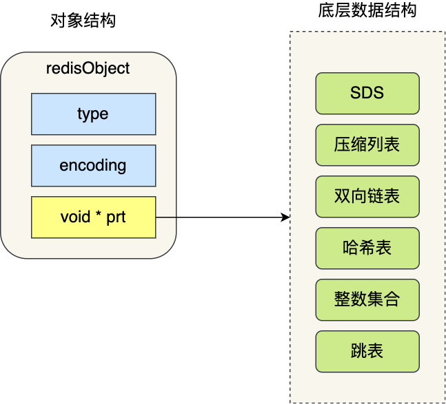

**Redis**
- [定义](#定义)
- [使用](#使用)
  - [基础命令](#基础命令)
  - [数据类型](#数据类型)
  - [数据结构](#数据结构)
  - [持久化](#持久化)
  - [内存管理](#内存管理)
  - [高可用](#高可用)
  
# 定义 #
键值数据库

# 使用 #
## 基础命令 ##
```
key 
- `KEYS pattern`  查找所有符合给定模式的键  ?|*|[]|^|-
- `SCAN cursor [MATCH pattern] [COUNT count] [TYPE type]`  迭代数据库中的键
- `EXISTS key`  检查给定键是否存在
- `TYPE key`  返回键所储存的值的类型
- `RANDOMKEY`  随机返回一个键
- `DEL key`  删除键
- `UNLINK key`  异步删除键
- `RENAME key newkey`  修改键的名称
- `RENAMENX key newkey`  修改键的名称, 新键不存在
- `MOVE key db`  将当前数据库的键移动到给定的数据库db中
- `DUMP key`  序列化键
- `RESTORE key ttl serialized-value`  反序列化
- `EXPIRE key seconds`  设置键过期时间，以秒计
- `PEXPIRE key milliseconds`  设置键过期时间，以毫秒计
- `EXPIREAT key unix-time-seconds`  设置键过期时间的时间戳，以秒计
- `PEXPIREAT key unix-time-milliseconds`  设置键过期时间的时间戳，以毫秒计
- `PERSIST KEY`  设置键永久有效
- `TTL key`  以秒为单位返回键的剩余过期时间
- `PTTL key`  以毫秒为单位返回键的剩余过期时间

db  
- `SELECT db`  切换数据库
- `FLUSHDB`  清空当前数据库中的所有键
- `FLUSHALL`  清空所有数据库的所有键
- `DBSIZE`  当前数据库的key数量

string 
- `SET key value [EX second | PX millisecond] [EXAT timestamp | PXAT timestamp] [nx|xx] [GET] [KEEPTTL]` 设置键值对
- `SETNX key value` 设置键值对，key不存在
- `SETEX key second value` 设置过期时间，以秒为单位
- `PSETEX key millisecond value` 设置过期时间，以毫秒为单位
- `APPEND key value` 追加值
- `INCR key` 自增1
- `INCRBY key increment` 指定自增量，整数
- `INCRBYFLOAT key increment` 指定自增量，浮点数
- `DECR key` 自减1
- `DECRBY key decrement` 指定自减量，整数
- `MSET key value [key value]` 批量设置
- `MSETNX key value [key value]` 批量设置，key不存在
- `GET key` 获取key
- `GETSET key value` 设置新值，返回旧值
- `MGET key [key]` 批量获取key
- `SETRANGE key offset value` 从指定位置覆盖值 
- `GETRANGE key start end` 获取指定位置字符串
- `STRLEN key` 获取字符串长度

list 
- `LPUSH key value [value]` 左边添加列表元素
- `LPUSHX key value [value]` 左边添加列表元素，key已存在
- `RPUSH key value [value]` 右边添加列表元素
- `RPUSHX key value [value]` 右边添加列表元素，key已存在
- `LINSERT key BEFORE|AFTER pivot value` 在指定位置添加列表元素
- `LPOP key` 左边移除列表元素
- `BLPOP key [key] timeout` 左边移除列表元素，等待指定时间
- `RPOP key` 右边边移除列表元素
- `BRPOP key [key] timeout` 右边移除列表元素，等待指定时间
- `RPOPLPUSH source destination` 右边移除列表元素，左边追加列表元素
- `BRPOPLPUSH source destination timeout` 右边移除列表元素，左边追加列表元素，等待指定时间
- `LREM key count value` 移除列表元素
- `LTRIM key start stop` 保留列表指定区间的元素
- `LSET key index value` 通过索引设置列表的值
- `LINDEX key index` 通过索引获取列表的值
- `LRANGE key start stop` 获取指定范围的值
- `LLEN key` 获取列表长度

hash
- `HSET key field value`  设置哈希表字段
- `HSETNX key field value`  设置哈希表字段，属性不存在
- `HMSET key field value field value`  批量设置哈希表字段
- `HDEL key field [field]`  删除哈希表字段
- `HINCRBY key field increment`  自增，按整型值
- `HINCRBYFLOAT key field increment`  自增，按浮点值
- `HEXISTS key field`  判断哈希表字段是否存在
- `HGET key field`  获取哈希表字段
- `HMGET key field field`  批量获取哈希表字段
- `HKEYS key`  获取哈希表所有字段
- `HVALS key` 获取哈希表所有值
- `HGETALL key`  获取哈希表所有字段和值
- `HLEN key`  获取哈希表长度

set
- `SADD key member [member]`  向集合中添加元素
- `SPOP key`  随机从集合中移除元素
- `SREM key member [member]`  从集合中移除指定元素
- `SMOVE source destination member` 移动集合元素
- `SISMEMBER key member`  判断元素是否在集合中
- `SRANDOMMEMBER key count`  随机返回集合中的元素
- `SMEMBERS key`  返回集合中所有元素
- `SINTER key key`  求集合交集
- `SINTERSTORE destination key key`  存储集合交集
- `SUNION key key`  求集合并集
- `SUNIONSTORE destination key key`  存储集合并集
- `SDIFF key key`  求集合差集
- `SDIFFSTORE destination key key`  存储集合差集
- `SCARD key`  获取集合长度

sorted set
- `ZADD key score member [score member]`  添加元素
- `ZINCRBY key increment member`  自增
- `ZREM key member [member]`  移除元素
- `ZREMRANGEBYRANK key start stop`  按排名区间移除元素
- `ZREMRANGEBYSCORE key min max`  按分数区间移除元素
- `ZREMRANGEBYLEX key min max`  按字典区间移除元素
- `ZRANK key member`  获取元素排名
- `ZREVRANK key member`  获取元素反向排名
- `ZSCORE key member`  获取元素分数
- `ZRANGE key start stop [WITHSCORES]`  获取指定排名区间的成员
- `ZREVRANGE key start stop [WITHSCORES]`  获取指定排名区间的成员
- `ZRANGEBYSCORE key min max [WITHSCORES] [LIMIT offset count]`  获取指定分数区间的成员
- `ZREVRANGEBYSCORE key min max [WITHSCORES]`  获取指定分数区间的成员
- `ZRANGEBYLEX key min max [LIMIT offset count]`  获取指定字典区间的成员
- `ZINTERSTORE destination numkeys key key`  存储交集
- `ZUNIONSTORE destination numkeys key key`  存储并集
- `ZCARD key`  获取成员数量
- `ZCOUNT key min max`  获取分数区间的成员数量
- `ZLEXCOUNT key min max`  获取字典区间的成员数量

bit
- `SETBIT key offset value`  设置bit位
- `GETBIT key offset`  获取bit位
- `BITPOS key bit [start] [end] [BYTE|BIT]` 在指定字节区间查找bit出现的位置
- `BITCOUNT key [start] [end]`  在指定位区间统计1出现的次数
- `BITOP operation destkey key key`  对key进行位运算

hyperloglog
- `PFADD key element [element]`  添加元素
- `PFCOUNT key [key]`   获取统计数量
- `PFMERGE destkey sourcekey sourcekey`  合并多个集合

geo
- `GEOADD key longitude latitude member [longitude latitude member]`  添加坐标
- `GEOPOS key member [member]`  获取坐标
- `GEODIST key member member [m|km|ft|mi]`  获取两个位置的距离
- `GEORADIUS key longitude latitude radius [m|km|ft|mi] [WITHCOORD] [WITHDIST] [WITHHASH] [COUNT count] [AES|DESC] [STORE key]`  以给定的经纬度为中心， 返回指定范围内的元素
- `GEORADIUSBYMEMBER key member radius m|km|ft|mi [WITHCOORD] [WITHDIST] [WITHHASH] [COUNT count] [AES|DESC] [STORE key]`  以给定的位置为中心， 返回指定范围内的元素
- `GEOHASH key member [member]`  获取坐标的hash位置

stream
- `XADD key id field value [field value]`  添加消息
- `XDEL key id [id]`  删除消息
- `XTRIM key [MAXLEN|MINIID] [~] [count]`  裁剪为指定数量的项目
- `XRANGE key start end [COUNT count]`  获取消息列表
- `XREVRANGE key end start [COUNT count]` 反向获取消息列表
- `XREAD [COUNT count] [BLOCK milliseconds] STREAMS key [key] id [id]` 获取消息
- `XLEN key`  获取消息长度
- `XGROUP CREATE key group <id|$> [MKSTREAM]`  创建消费组
- `XREADGROUP GROUP group consumer [COUNT count] [BLOCK milliseconds] STREAMS key [key ...] id [id ...]`  创建消费者
- `XPENDING key group [[IDLE min-idle-time] start end count [consumer]]`  查看消费情况
- `XACK key group id [id ...]`  确认消息
- `XCLAIM key group consumer min-idle-time id [id ...]`  转移消息
- `XINFO STREAM key`  查看队列状态
- `XINFO GROUPS key`  查看组状态
- `XINFO CONSUMERS key group`  查看消费者状态

事务
- MULTI  开始事务
- EXEC  执行事务
- DISCARD  取消事务
- WATCH key [key]  监视key
- UNWATCH  取消监视

发布&订阅
- SUBSCRIBE channel [channel]  订阅频道
- PSUBSCRIBE pattern [pattern]  订阅指定模式的频道
- UNSUBSCRIBE channel [channel]  退订频道
- PUNSUBSCRIBE pattern [pattern]  退订指定模式的频道
- PUBLISH channel message  发送消息
```

## 数据类型 ##
**字符串(string)**
```
内部实现
- int(整数) 字符串对象保存的是整数值，并且这个整数值可以用long类型来表示
- embstr(sds) 字符串的长度小于等于44字节
- raw(sds)

应用
- 缓存对象
- 计数
- 分布式锁
```

**列表(list)**
```
内部实现
- quicklist

应用
- 消息队列
```
  
**哈希(hash)**
```
内部实现
- listpack(元素个数小于512个, 元素值小于64字节)
- 哈希表

应用  
- 缓存对象
```

**集合(set)**
```
内部实现  
- 整数集合(元素个数小于512个, 元素都是整数)
- 哈希表
  
应用  
- 点赞
- 关注
- 抽奖  
```

**有序集合(sorted set)**
```
内部实现
- listpack(元素个数小于128个，元素的值小于64字节)
- 跳表

应用 
- 排行榜
- 排序
```

**位图(bitmap)**
```
内部实现
- string
  
应用  
- 签到
- 登陆
```

**基数统计(hyperloglog)**
```
应用  
- UV计数
```


**位置(geo)**
```
内部实现
- sorted set

应用  
- 打车
```

**流(stream)**
```
应用
- 消息队列
```

## 数据结构 ##
**redis存储模型**  
  
```
- redisDb结构  Redis数据库的结构 结构体里存放了指向了dict结构的指针   
- dict结构  结构体里存放了2个哈希表，正常情况下都是用「哈希表1」，「哈希表2」只有在 rehash 的时候才用  
- ditctht结构 结构里存放了哈希表数组，数组中的每个元素都是指向一个哈希表节点结构（dictEntry）的指针  
- dictEntry结构  结构里存放了key和value指针，key指向的是String对象，而value则可以指向String对象，也可以指向集合类型的对象，比如List对象、Hash对象、Set对象和Zset对象  
```

**redis对象** 
 
``` 
- type  标识该对象是什么类型的对象（String对象、List对象、Hash对象、Set对象和Zset对象） 
- encoding  标识该对象使用了哪种底层的数据结构  
- ptr  指向底层数据结构的指针  
```

**sds**
```
结构
struct __attribute__ ((__packed__)) sdshdr16 {
    uint16_t len;
    uint16_t alloc; 
    unsigned char flags; 
    char buf[];
}
- len  记录了字符串长度    
- alloc  分配给字符数组的空间长度  
- flags  不同容量的sds，sdshdr5、sdshdr8、sdshdr16、sdshdr32和sdshdr64  
- buf[]  字符数组，用来保存实际数据  

优点 
- 高效  
  直接获取长度 
- 二进制安全  
  不以\0结束
- 节省空间  
  不同的容量
  不字节拉齐
```

**链表**
```
结构
typedef struct listNode {
    //前置节点
    struct listNode *prev;
    //后置节点
    struct listNode *next;
    //节点的值
    void *value;
}

typedef struct list {
    //链表头节点
    listNode *head;
    //链表尾节点
    listNode *tail;
    //节点值复制函数
    void *(*dup)(void *ptr);
    //节点值释放函数
    void (*free)(void *ptr);
    //节点值比较函数
    int (*match)(void *ptr, void *key);
    //链表节点数量
    unsigned long len;
}

优点
- 获取某个节点的前置节点或后置节点的时间复杂度只需O(1)
- 获取链表的表头节点和表尾节点的时间复杂度只需O(1)
- 获取链表中的节点数量的时间复杂度只需O(1)
缺点
- 内存都是不连续的，无法很好利用CPU缓存
- 保存一个链表节点的值都需要一个链表节点结构头的分配，内存开销较大
```

**压缩列表**
 
```
结构
- zlbytes  记录整个压缩列表占用内存字节数
- zltail  记录压缩列表「尾部」节点距离起始地址由多少字节 也就是列表尾的偏移量
- zllen  记录压缩列表包含的节点数量
- zlend  标记压缩列表的结束点，固定值0xFF(十进制255)

entry
- prevlen  记录了「前一个节点」的长度，目的是为了实现从后向前遍历
- encoding  记录了当前节点实际数据的「类型和长度」，类型主要有两种：字符串和整数
- data  记录了当前节点的实际数据，类型和长度都由 encoding 决定

优点
- 占用一块连续的内存空间，可以利用CPU缓存
缺点
- 不能保存过多的元素，否则查询效率就会降低
- 新增或修改某个元素时，压缩列表占用的内存空间需要重新分配，甚至可能引发连锁更新的问题
```

**哈希表**
```
typedef struct dictht {
    //哈希表数组
    dictEntry **table;
    //哈希表大小
    unsigned long size;  
    //哈希表大小掩码，用于计算索引值
    unsigned long sizemask;
    //该哈希表已有的节点数量
    unsigned long used;
}

typedef struct dictEntry {
    //键值对中的键
    void *key;
  
    //键值对中的值
    union {
        void *val;
        uint64_t u64;
        int64_t s64;
        double d;
    } v;
    //指向下一个哈希表节点，形成链表
    struct dictEntry *next;
}

缺点
哈希冲突加剧，导致查询性能降低

解决
refresh
```

**整数集合**
```
结构
typedef struct intset {
    //编码方式
    uint32_t encoding;
    //集合包含的元素数量
    uint32_t length;
    //保存元素的数组
    int8_t contents[];
}

整数集合升级
过程
- 当我们将一个新元素加入到整数集合里面，如果新元素的类型比整数集合现有所有元素的类型都要长时，整数集合需要先进行升级，也就是按新元素的类型扩展contents数组的空间大小，然后才能将新元素加入到整数集合里，当然升级的过程中，也要维持整数集合的有序性
- 整数集合升级的过程不会重新分配一个新类型的数组，而是在原本的数组上扩展空间，然后在将每个元素按间隔类型大小分割
好处
- 节省内存资源
```

**跳表**
```
typedef struct zskiplistNode {
    //Zset 对象的元素值
    sds ele;
    //元素权重值
    double score;
    //后向指针
    struct zskiplistNode *backward;
  
    //节点的level数组，保存每层上的前向指针和跨度
    struct zskiplistLevel {
        struct zskiplistNode *forward;
        unsigned long span;
    } level[];
}
- span 上一个节点到当前节点之前的节点数

typedef struct zskiplist {
    struct zskiplistNode *header, *tail;
    unsigned long length;
    int level;
}
- 头尾节点  便于在O(1)时间复杂度内访问跳表的头节点和尾节点
- 长度  便于在O(1)时间复杂度获取跳表节点的数量
- 最大层数  便于在O(1)时间复杂度获取跳表中层高最大的那个节点的层数量

查询过程
- 如果当前节点的权重「小于」要查找的权重时，跳表就会访问该层上的下一个节点
- 如果当前节点的权重「等于」要查找的权重时，并且当前节点的 SDS 类型数据「小于」要查找的数据时，跳表就会访问该层上的下一个节点
- 下一个节点为空时，跳表就会使用目前遍历到的节点的 level 数组里的下一层指针，然后沿着下一层指针继续查找

层数设置
跳表在创建节点时候，会生成范围为[0-1]的一个随机数，如果这个随机数小于等于0.25（相当于概率25%），那么层数就增加1层，然后继续生成下一个随机数，直到随机数的结果大于0.25结束，最终确定该节点的层数
```

**quicklist**
```
结构
typedef struct quicklist {
    //quicklist的链表头
    quicklistNode *head;
    //quicklist的链表尾
    quicklistNode *tail; 
    //所有压缩列表中的总元素个数
    unsigned long count;
    //quicklistNodes的个数
    unsigned long len;       
} 

typedef struct quicklistNode {
    //前一个quicklistNode
    struct quicklistNode *prev; 
    //下一个quicklistNode
    struct quicklistNode *next;
    //quicklistNode指向的压缩列表
    unsigned char *zl;              
    //压缩列表的的字节大小
    unsigned int sz;                
    //压缩列表的元素个数
    unsigned int count;
    ....
}

```

**listpack**

```
结构
- encoding  定义该元素的编码类型，会对不同长度的整数和字符串进行编码
- data  实际存放的数据
- len  encoding+data的总长度
```

## 持久化 ##
**aof**
```
开启
redis.conf
appendonly yes //是否开启aof持久化(默认no:关闭)
appendfilename "appendonly.aof" //aof持久化文件名称

手动
bgrewriteaof(异步)

执行过程
- 执行写命令
- 记录命令到日志
优点
- 避免额外检查开销
- 不会阻塞当前操作命令
缺点
- 写命令和写日志是两个过程，有丢失数据的风险
- 阻塞下一个命令的执行

写回策略
- Always  每次写操作命令执行完后，同步将AOF日志数据写回硬盘
- Everysec  每次写操作命令执行完后，先将命令写入到AOF文件的内核缓冲区，然后每隔一秒将缓冲区里的内容写回到硬盘
- No  每次写操作命令执行完后，先将命令写入到AOF文件的内核缓冲区，再由操作系统决定何时将缓冲区内容写回硬盘

fsync()函数的调用时机
- Always  每次写入AOF文件数据后，就执行fsync()函数；
- Everysec  创建一个异步任务来执行fsync()函数；
- No  永不执行fsync()函数

AOF重写机制
- 主进程在通过fork系统调用生成bgrewriteaof子进程(会阻塞主进程)
- 子进程进行aof文件重写(异步执行)
- 主进程修改了已经存在key-value，发生写时复制(会阻塞主进程)
- 子进程完成AOF重写工作，会向主进程发送一条信号
- 主进程收到信号后，将AOF重写缓冲区中的所有内容追加到新的AOF的文件中，新的AOF的文件进行改名，覆盖现有的AOF文件(会阻塞主进程)
```

**rdb**
```
配置
save 900 1
save 300 10
save 60 10000

手动
save(同步)
bgsave(异步)

过程
- 主进程在通过fork系统调用生成bgsave子进程(会阻塞主进程)
- 子进程进行全量快照
- 主进程修改了已经存在key-value，发生写时复制(会阻塞主进程)
```

**rdb&aof**
```
配置
redis.conf
aof-use-rdb-preamble yes

过程
当开启了混合持久化时，在AOF重写日志时，fork出来的重写子进程会先将与主线程共享的内存数据以RDB方式写入到AOF文件，然后主线程处理的操作命令会被记录在重写缓冲区里，重写缓冲区里的增量命令会以AOF方式写入到AOF文件，写入完成后通知主进程将新的含有RDB格式和AOF格式的AOF文件替换旧的的AOF文件
```

**大key对持久化的影响**
```
aof
- 当使用Always策略的时候，如果写入是一个大Key，主线程在执行fsync()函数的时候，阻塞的时间会比较久，因为当写入的数据量很大的时候，数据同步到硬盘这个过程是很耗时的
- 当使用Everysec策略的时候，由于是异步执行fsync()函数，所以大Key持久化的过程不会影响主线程。
- 当使用No策略的时候，由于永不执行fsync()函数，所以大Key持久化的过程不会影响主线程

rdb
- 创建子进程的途中，由于要复制父进程的页表等数据结构，阻塞的时间跟页表的大小有关，页表越大，阻塞的时间也越长
- 创建完子进程后，如果子进程或者父进程修改了共享数据，就会发生写时复制，这期间会拷贝物理内存，如果内存越大，自然阻塞的时间也越长
```

## 内存管理 ##
**过期删除**
```
判定key已过期
每当我们对一个key设置了过期时间时，Redis会把该key带上过期时间存储到一个过期字典(expires dict)中，也就是说「过期字典」保存了数据库中所有 key 的过期时间
当我们查询一个key时，Redis首先检查该key是否存在于过期字典中
- 如果不在，则正常读取键值
- 如果存在，则会获取该key的过期时间，然后与当前系统时间进行比对，如果比系统时间大，那就没有过期，否则判定该key已过期

策略
- 定时删除
  在设置key的过期时间时，同时创建一个定时事件，当时间到达时，由事件处理器自动执行key的删除操作
  内存可以被尽快地释放，对CPU不友好
- 惰性删除
  不主动删除过期键，每次从数据库访问key时，都检测key是否过期，如果过期则删除该key
  对CPU时间最友好，内存无法得到及时释放
- 定期删除
  每隔一段时间「随机」从数据库中取出一定数量的key进行检查，并删除其中的过期key
  已过期key的数量占比大于25%，再删除一轮， 如果超过定期删除循环流程的时间上限就结束

redis采用的策略
惰性删除+定期删除
```

**内存淘汰**
```
设置Redis最大运行内存
redis.conf
maxmemory <bytes>
- 在64位操作系统中，maxmemory的默认值是0，表示没有内存大小限制
- 在32位操作系统中，maxmemory的默认值是3G，因为32位的机器最大只支持4GB的内存，而系统本身就需要一定的内存资源来支持运行

策略
- 不进行数据淘汰
  - noeviction  当运行内存超过最大设置内存时，不淘汰任何数据，这时如果有新的数据写入，会报错通知禁止写入，不淘汰任何数据
- 进行数据淘汰
  - volatile-random：随机淘汰设置了过期时间的任意键值
  - volatile-ttl：优先淘汰更早过期的键值
  - volatile-lru  淘汰所有设置了过期时间的键值中，最久未使用的键值
  - volatile-lfu  淘汰所有设置了过期时间的键值中，最少使用的键值
  - allkeys-random 随机淘汰任意键值
  - allkeys-lru 淘汰整个键值中最久未使用的键值
  - allkeys-lfu 淘汰整个键值中最少使用的键值

设置
`config get maxmemory-policy`  查看当前淘汰策略
`config set maxmemory-policy <策略>`  设置当前淘汰策略

lru实现
Redis对象头的24bits的lru字段是用来记录key的访问时间戳
随机取5个值(此值可配置)，然后淘汰最久没有使用的那个

lfu实现
Redis对象头的24bits的lru字段被分成两段来存储，高16bit存储ldt(Last Decrement Time)，低8bit存储logc(Logistic Counter)
- ldt是用来记录key的访问时间戳
- logc是用来记录key的访问频次，它的值越小表示使用频率越低，越容易淘汰，每个新加入的key的logc初始值为5
随机取5个值(此值可配置)，然后淘汰频次最小的

Redis在访问key时，对于logc是这样变化的
- 先按照上次访问距离当前的时长，来对logc进行衰减
- 再按照一定概率增加logc的值

redis.conf提供了两个配置项，用于调整lfu算法从而控制logc的增长和衰减
- lfu-decay-time 用于调整logc的衰减速度，它是一个以分钟为单位的数值，默认值为1，lfu-decay-time值越大，衰减越慢
- lfu-log-factor 用于调整logc的增长速度，lfu-log-factor值越大，logc增长越慢
```

**缓存**
```
雪崩
原因
- 大量数据同时过期
- Redis故障宕机
解决方法
- 均匀设置过期时间
- 服务熔断或请求限流机制
- 构建Redis缓存高可靠集群

击穿
原因
- 某个热点数据过期了，此时大量的请求访问了该热点数据
解决方法
- 互斥锁方案，保证同一时间只有一个业务线程更新缓存，未能获取互斥锁的请求，要么等待锁释放后重新读取缓存，要么就返回空值或者默认值
- 不给热点数据设置过期时间

穿透
原因
- 业务误操作
- 黑客恶意攻击
解决方法
- 非法请求的限制
- 缓存空值或者默认值
- 使用布隆过滤器快速判断数据是否存在，避免通过查询数据库来判断数据是否存在

一致性
- 先更新数据库，再删除缓存
```

## 高可用 ##
**主从复制**
```
命令
replicaof <服务器的IP地址> <服务器的Redis端口号>

第一次同步
- 建立链接、协商同步
- 主服务器同步数据给从服务器(rdb文件)
- 主服务器发送新写操作命令给从服务器(replication buffer 缓冲区)

命令传播
主从服务器在完成第一次同步后，双方之间就会维护一个 TCP 连接

增量同步
```

**哨兵**
```
集群组成
sentinel monitor <master-name> <ip> <redis-port> <quorum>
- 通过Redis的发布者/订阅者机制，哨兵之间可以相互感知，然后组成集群，
- 哨兵又通过INFO命令，在主节点里获得了所有从节点连接信息，于是就能和从节点建立连接，并进行监控了

主从故障转移
- 在已下线主节点（旧主节点）属下的所有「从节点」里面，挑选出一个从节点，并将其转换为主节点
- 让已下线主节点属下的所有「从节点」修改复制目标，修改为复制「新主节点」
- 将新主节点的 IP 地址和信息，通过「发布者/订阅者机制」通知给客户端
- 继续监视旧主节点，当这个旧主节点重新上线时，将它设置为新主节点的从节点
```